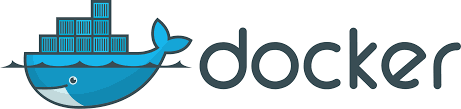

# Introduction to DevOps Lab2
**Leonid Zelenskiy**  
**B21-CS-01**  
*l.zelenskiy@innopolis.university*

## **Docker**

Docker is an open platform for appliation development, deployment and exploitation. With docker you can **separate** infrastructure from application and communicate with insfrastructure as an another application.

**Docker key features and functionalities:**
- Faster and easier configuration
- Application isolation
- Swarm 
- Security Management 
- Rapid scaling of Systems 
- Better Software Delivery 

**Use case**
For example it is used in microservice projects. Docker makes it possible to isolate each service and let them communicate between each other.