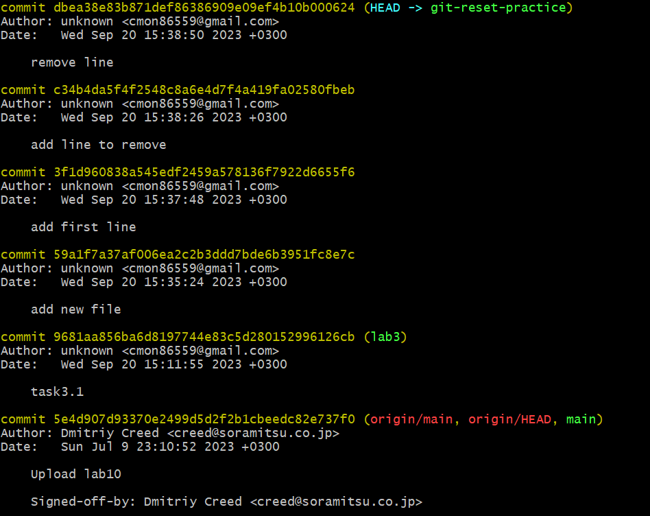
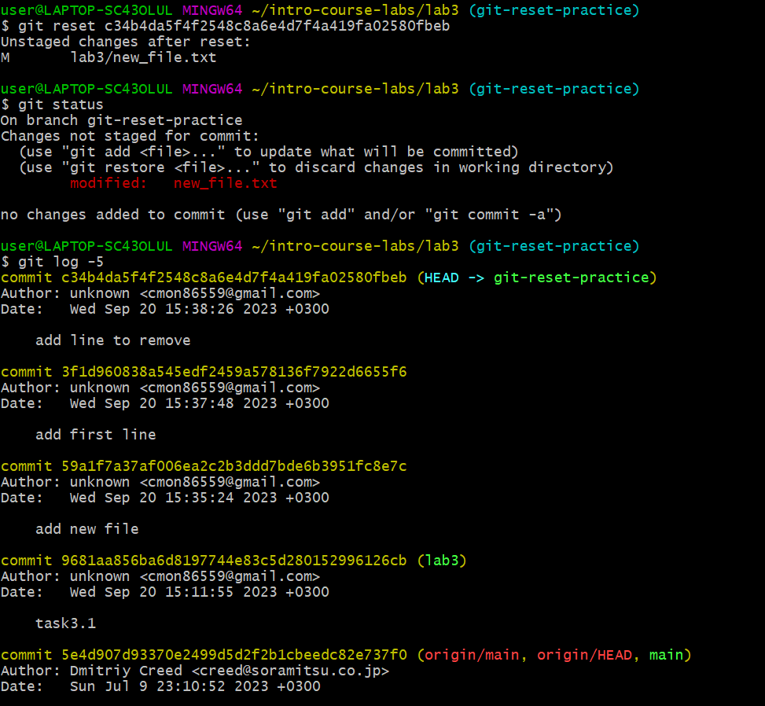
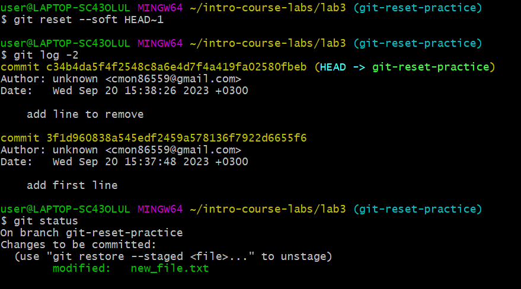
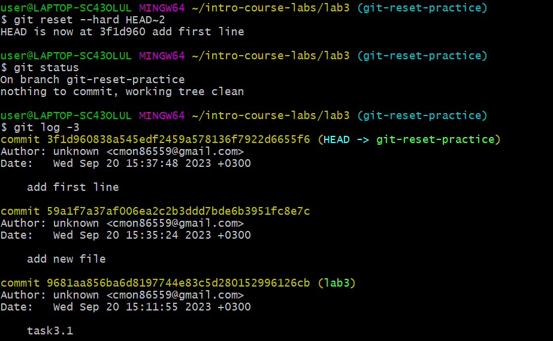

# Commits history
1. Create file "new_file.txt". Commit: "add new file" 
2. Add line to file: "first line". Commit: "add first line"
3. Add line to file: "line to remove. Commit: "add line to remove"
4. Remove last line from file. Commit: "remove line"

# Git reset options
- `git reset c34b4da5f` defaults to --mixed option. Does not affect file changes in working directory, but unstages them and removes commits after c34b4da5f.
Outputs:

- `git reset --soft HEAD~1` removes last commit and does not affect files in working directory but keeps changes staged. 
Outputs:

- `git reset --hard HEAD~2` removes last two commits from commit history, staging and working directory.
Outputs:

# Benefits and use cases:
The main use case of `git reset` is to undo or edit changes made in previous commits. `git reset --hard` is the most dangerous option as all changes can be lost. `git reset --mixed` is a safe way to move back to previous commits while keeping all changes. `git reset --soft` is also a safe way to go back in commit history while keeping changes staged. 