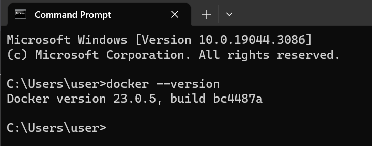
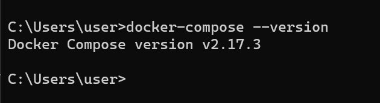

# Docker and Docker Compose Installation

## Docker Installation

To install Docker, follow these steps:

- Open a terminal or command prompt.

- Run the following command to install Docker using pip:

```
pip install docker
```

- After the installation is complete, you can verify the Docker version by running the following command:

```
docker --version
```

### My Docker version number




## Docker Compose Installation

To install Docker Compose, follow these steps:

- Open a terminal or command prompt.

- Run the following command to install Docker Compose using pip:

```
pip install docker-compose
```

- After the installation is complete, you can verify the Docker Compose version by running the following command:

```
docker-compose --version
```

### My Docker Compose version number




## Observations and Challenges

During the installation process, I encountered the following:

- **Internet connectivity**: Initially, I faced slow network connectivity, resulting in a significantly prolonged download time for Docker and Docker Compose packages. It is highly recommended to ensure a stable internet connection when downloading these packages to avoid potential delays.

- **System compatibility**: Docker and Docker Compose have specific system requirements that need to be met. It is crucial to verify that your operating system is supported and meets the necessary prerequisites before proceeding with the installation. See the official [Documentation](https://docs.docker.com/get-docker) for more information.

- **Administrative privileges**: I encountered this challenge while assisting a friend who uses a Mac laptop. We had to use the `sudo` command before executing the installation commands. Depending on your operating system, administrative privileges may be required to install Docker and Docker Compose. Ensure that you have the necessary permissions or administrative access to successfully complete the installation.

- **Pip installation**: In order to install Docker and Docker Compose, I had to ensure that `pip` was installed on my system. If `pip` is not already installed, it can be installed using package managers like apt or Homebrew, depending on your operating system. However, I installed `pip` using the following commands:

```
curl https://bootstrap.pypa.io/get-pip.py -o get-pip.py
python get-pip.py
```
