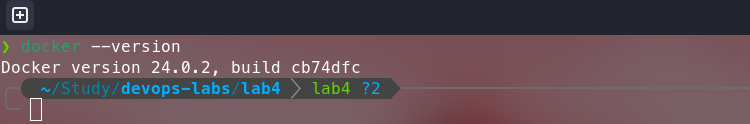
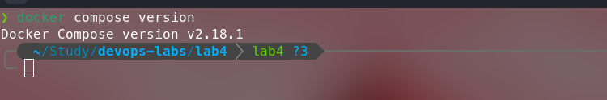

# Docker Installation

## How I installed Docker (Step by step)
1. Since I am using a Fedora Linux, I used a command
    ```bash
    sudo dnf install docker-ce docker-ce-cli containerd.io docker-buildx-plugin docker-compose-plugin
    ```
    to install all packages for docker from DNF package manager
2. After that, I need to start the Docker using the command `sudo systemctl start docker`
3. Now, I need to verify that docker is working correctly by running `sudo docker run hello-world`
    >This command downloads a test image and runs it in a container. When the container runs, it prints a confirmation message and exits.

## Docker version


## Docker Compose version


## Observations

Fun fact: `docker-compose` (docker compose v1) is deprecated since June 30, 2023.
Docker strongly recommends switching to docker compose v2
