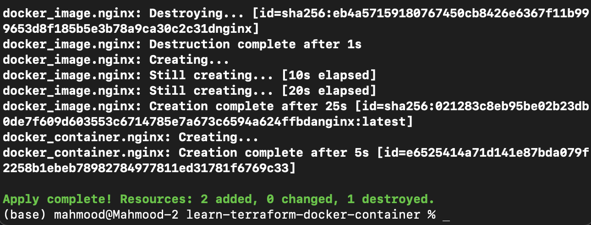
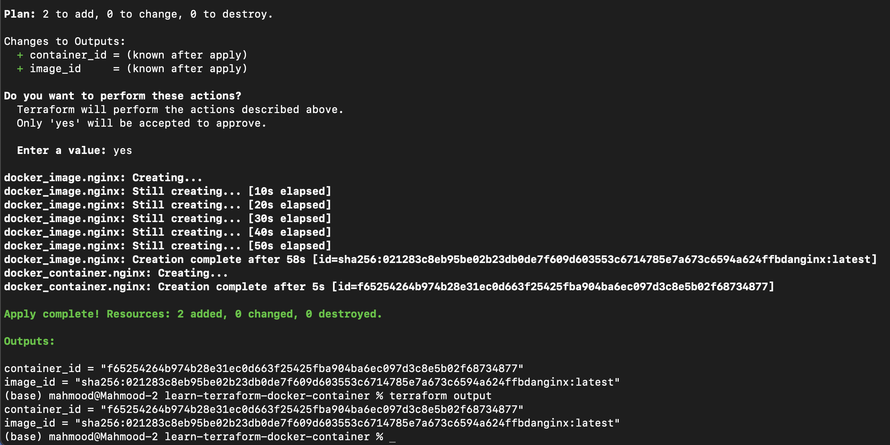

### Terraform Task

For reviewing the practical task files visit **Terraform** directory.

## Version
For getting the version of the terraform installed on the system use the command below:
``` sh
$ terraform --version
```
> Terraform v1.5.0

## Installation
For OS X follow the bellow instruction:

``` sh
$ brew tap hashicorp/tap
$ brew install hashicorp/tap/terraform
```
Verify the installation:

``` sh
$ terraform -help
```

## Commands
After creating and configuring the project:

Innitialization and applying:

``` sh
$ terraform init
$ terraform apply
```

After apply in localhost:8000 you should see the nginx running.

Destroying:

``` sh
$ terraform destroy
```

## Observation
1. Installation process is straightforward and well-documented.
2. Terraform is available for various operating systems (Windows, macOS, Linux).
3. The installation size is relatively small.
4. No additional dependencies or prerequisites are needed for basic installation.

## Practical task

**Apply:**



**Query & output:**
