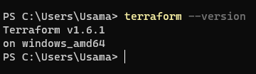
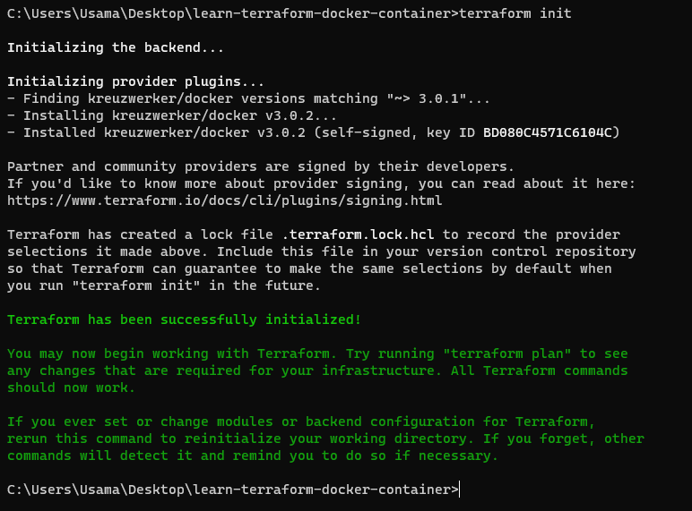
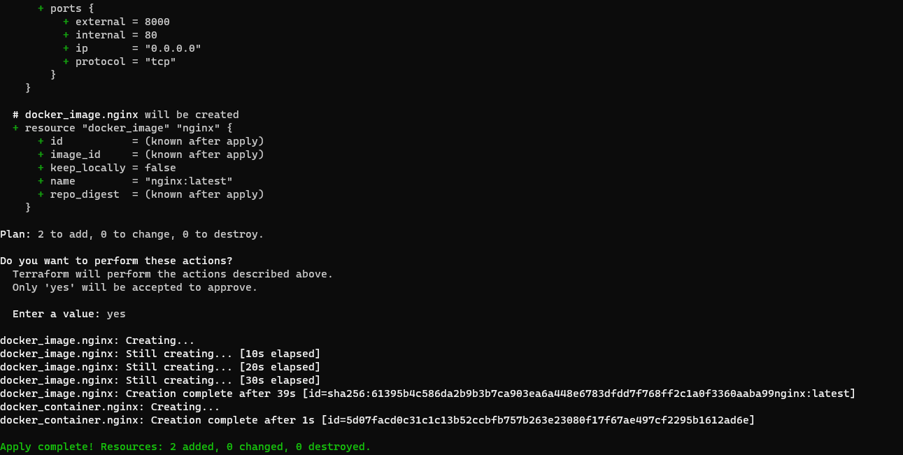
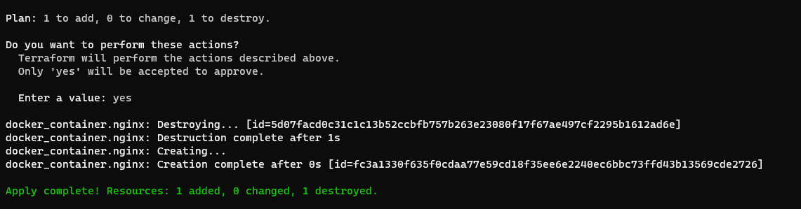
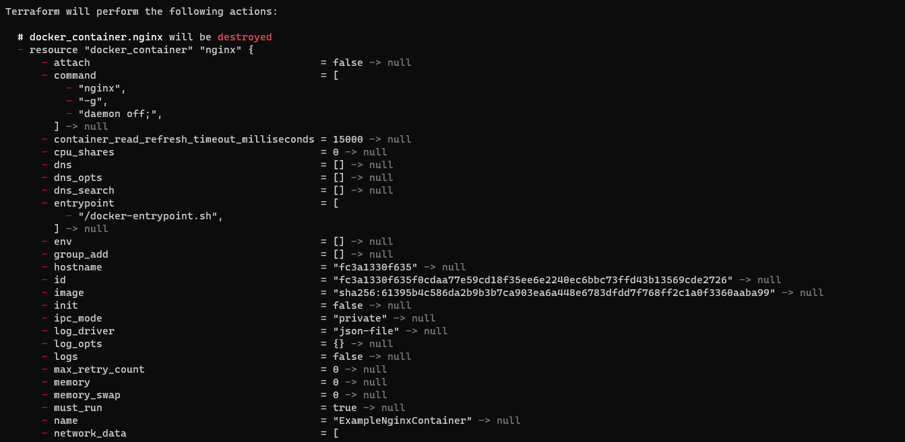
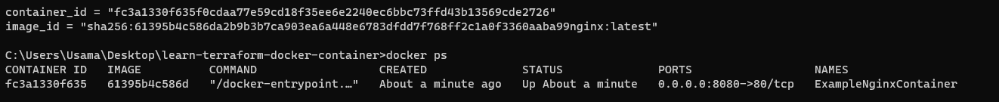
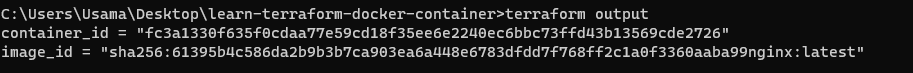

### Terraform Task

For reviewing the practical task files visit **Terraform** directory.

## Installation
For installation of terraform in windows follow the bellow instruction:
* Go to terraform download page. (https://developer.hashicorp.com/terraform/downloads?product_intent=terraform)
* Download the amd version it will be a zip file.
* Unzip it and copy the floder and paste it in C drive.
* After that go to edit environment and add the path.
* To make sure terraform install in your system check the version in Powershell.

## Version
For getting the version of the terraform installed on the system use the command below:
``` sh
 terraform --version
```


## Commands
After creating and configuring the project:

Innitialization and applying:

``` sh
 terraform init
 terraform apply
```

After apply in localhost:8000 you should see the nginx running.


Destroying:

``` sh
 terraform destroy
```

## Observation
1. Installation process is straightforward and well-documented.
2. Terraform is available for various operating systems (Windows, macOS, Linux).
3. The installation size is relatively small.
4. No additional dependencies or prerequisites are needed for basic installation.

## Practical Task
**Terraform init**



**Teraform apply**




**Terraform Destory**



**Docker output**


**Terraform Output and Query**

