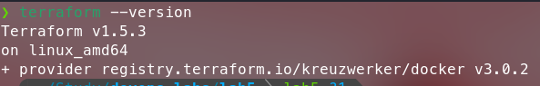

# Terraform and Nginx

## Installation process on Fedora

1. I checked an official tutorial on installation for Fedora
2. I realised that official repository in DNF Manager is outdated, so I could not install it using `dnf`
3. Therefore, I downloaded latest linux_amd64.zip release and moved it to bin manually using `sudo mv terraform /usr/local/bin`
4. Verify the installation by running `terraform --version` command

## Terraform version


## Command to initialize and apply terraform

```bash
terraform init
terraform apply
```
> After apply you need to confirm the changes


