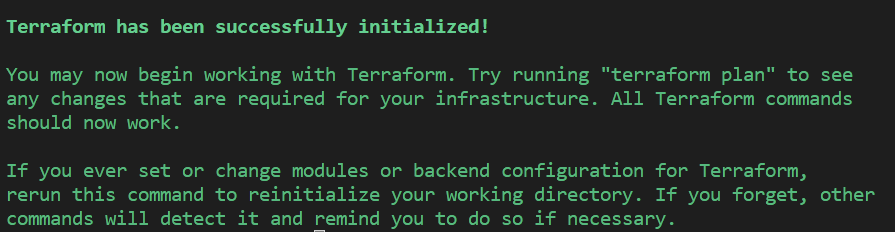
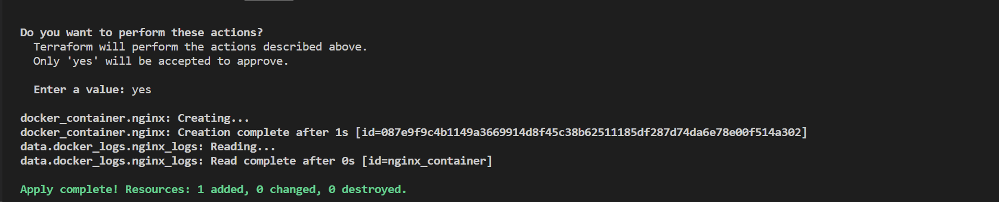
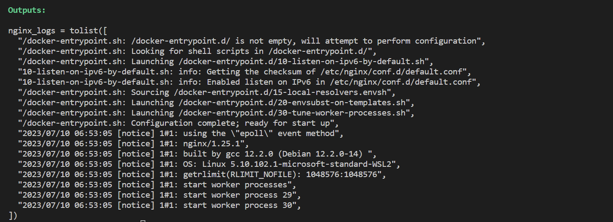
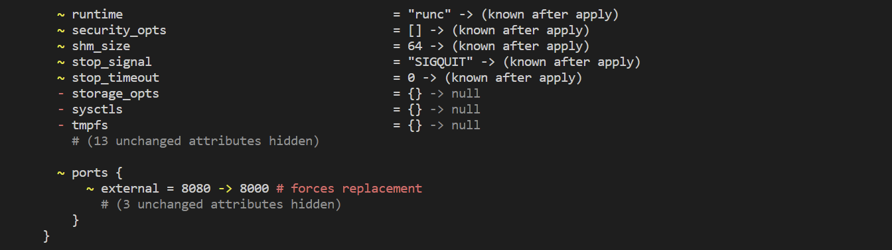
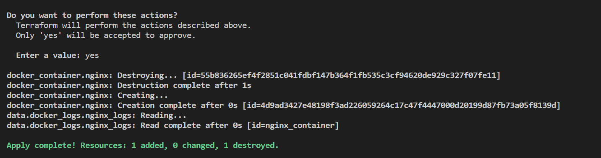
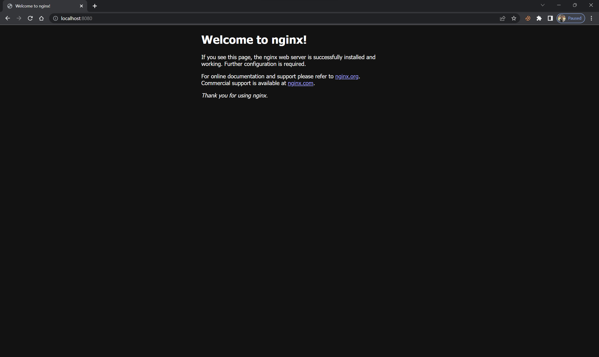
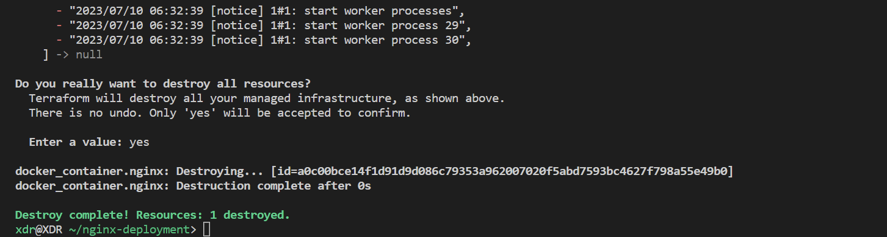

# Terraform Installation and Nginx Deployment

## Installation Steps for Terraform


1. **Download Terraform**:
   - Visit the official Terraform website (https://www.terraform.io/downloads.html).
   - Download the appropriate Terraform binary package for your operating system.

2. **Extract the Package**:
   - Extract the downloaded package to a directory of your choice.

3. **Set PATH Environment Variable**:
   - Add the Terraform binary directory to your system's PATH environment variable.
   - This step allows you to run the Terraform command from any location in the terminal.

4. **Verify Installation**:
   - Command:
        ```sh
        terraform version
        ```
   - Output:
        ```sh
        Terraform v1.5.2
        on linux_386
        ```

## Nginx Deployment with Terraform

1. **Create Terraform Configuration Files**:
   - Create a new directory for your Terraform configuration files (e.g., "nginx-deployment").
   - Within the directory, create a new file named "main.tf" and configure it with the necessary Terraform code for deploying an Nginx container.
   e.g.
        ```tf
        variable "nginx_port" {
            type    = number
            default = 8080
        }

        terraform {
            required_providers {
                docker = {
                source  = "kreuzwerker/docker"
                version = "3.0.2"
                }
            }
        }

        # Define the provider
        provider "docker" {
            host = "unix:///var/run/docker.sock"
        }

        # Define the Nginx container
        resource "docker_container" "nginx" {
            name  = "nginx_container"
            image = "nginx:latest"
            ports {
                internal = 80
                external = var.nginx_port
            }
            restart = "always"
        }
 
        # Get logs from the container
        data "docker_logs" "nginx_logs" {
            name = docker_container.nginx.name
        }

        # Output the logs
        output "nginx_logs" {
            value = data.docker_logs.nginx_logs.logs_list_string
        }

        ```

2. **Initialize Terraform**:
    - Open a terminal in the directory containing your Terraform configuration files.
    - Run the following command to initialize Terraform:
	    ```sh
        terraform init
        ```
    - Output:
        

3. **Apply the Terraform Configuration**:
   - After initialization, run the following command to apply the Terraform configuration and deploy the Nginx container:
		```sh
        terraform apply
        ```
   - Confirm the action by typing "yes" when prompted.
   - Output:
        

        

4. **Change the infrastructure**:
    - An example is to changethe value of the variable nginx_port to `8000` i nthe `main.tf` file.
    - Then running the following command:
        ```sh
        terraform apply
        ```
    - Confirm the action by typing "yes" when prompted.
    - Output:
        

        

5. **Access Nginx**:
   - Once the deployment is complete nginx can be accessed through any browser on localhost:[specified port]
   

6. **Destroy the Infrastructure**:
   - When you are finished with the Nginx deployment and want to tear down the infrastructure, run the following command:
        ```sh
        terraform destroy
        ```
   - Confirm the action by typing "yes" when prompted.
   - Output:
   

## Observations and Challenges

During the installation and deployment process, you may encounter the following observations or challenges:

1. **Terraform Version**: Ensure that you have downloaded the latest stable version of Terraform or the version recommended for your specific use case.

2. **PATH Configuration**: Properly setting the PATH environment variable is crucial to ensure that the Terraform binary is accessible from any location in the terminal.

3. **Terraform Initialization**: Running `terraform init` initializes the working directory and downloads the necessary provider plugins. Ensure that you have an active internet connection during this step.

4. **Terraform Configuration**: Creating the main.tf file and configuring it with the appropriate Terraform code can be challenging, especially for complex infrastructure setups. Refer to the Terraform documentation and examples for guidance.

5. **Infrastructure Provisioning**: The deployment process involves provisioning infrastructure resources, which may take some time depending on the complexity of the setup and the cloud provider being used.

6. **Networking and Access**: Ensure that your network configuration allows incoming connections to the deployed Nginx container and that you can access it using the provided IP address or hostname.