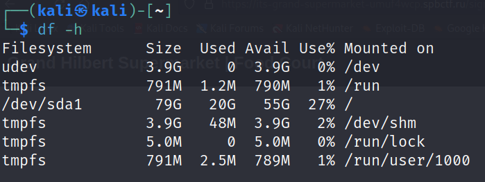
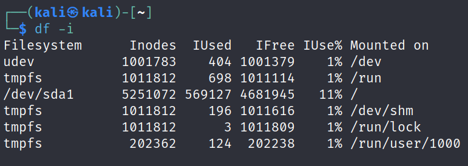
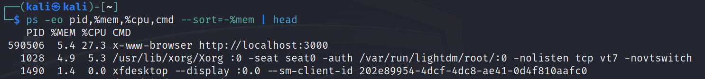

#  Task 1: Operating System Analysis

## Analyze Disk Space

To check the available disk space on your operating system, you can use the `df` command for Unix-based operating systems and `wmic` for Windows.

```
df -h   // unix-based
wmic logicaldisk get deviceid, freespace, size  // windows
```

### Output:


## Inodes Analysis

To check the number of inodes on your operating system, you can use the `df -i` command for Unix-based operating systems. This tool or command displays information about the file system inode usage.

**Note**: Inodes are data structures used in Unix-like file systems to store metadata about files, such as permissions, ownership, and file attributes. They are specific to Unix-like file systems and are not applicable to Windows systems. Windows uses a different file system structure called NTFS (New Technology File System), which does not have an equivalent concept of inodes.

```
df -i   // unix-based
```

## Resource Consumption Analysis:
To identify the process consuming the most RAM and CPU on your operating system, you can use the `top` command for Unix-based operating systems and either the Task Manager tool or the `Get-Process` command in PowerShell for Windows. This command provides real-time information about the system processes, including CPU and memory usage.

```
top // unix-based

// view the top 5 consuming processes and their CPU usage:
Get-Process | Sort-Object CPU -Descending | Select-Object -First 5

// view the top 5 consuming processes and their memory usage:
Get-Process | Sort-Object WorkingSet -Descending | Select-Object -First 5
```

### Output for CPU Usage:



### Observations:

- The `Code` process is consuming the highest CPU usage, with the top three instances listed.
- The `chrome` process also appears in the top CPU-consuming processes.

### Output for Memory Usage:



### Observations:

- The `Memory Compression` process has the highest working set (memory) usage.
- The `chrome` process appears multiple times in the top memory-consuming processes.
- The `Code` process also appears in the top memory-consuming processes.
