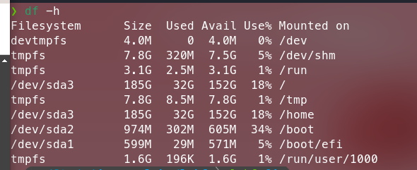
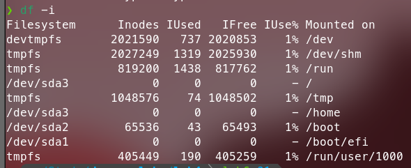
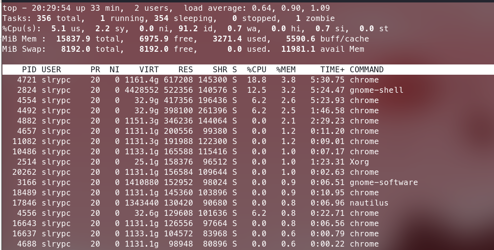
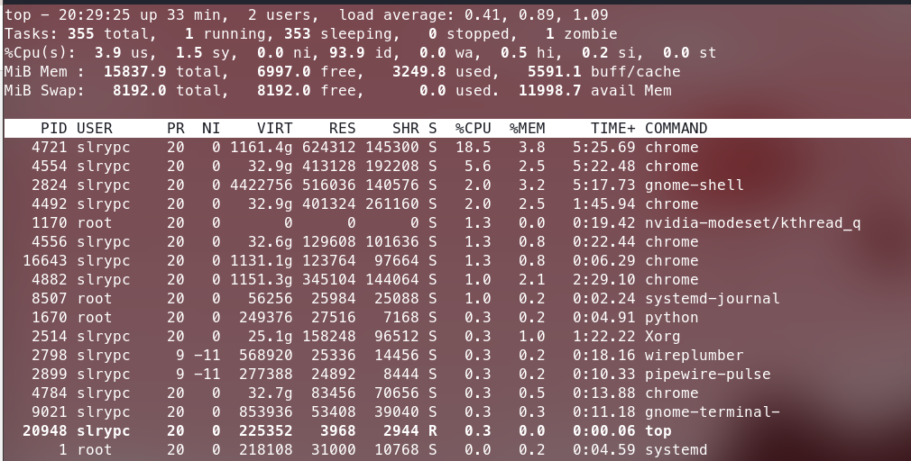

# Operating System Analysis

## Disk Space
To check disk space on Fedora Linux Distribution, we can run following command
```bash
df -h
```

### Result


## Inodes Analysis
To check number of inodes on Fedora Linux Distribution, we can run following command
```bash
df -i
```

### Result


## Resource Consumption
To identify processes consuming the most RAM, we can run following command
```bash
top -o %MEM
```

### Result


To identify processes consuming the most CPU, we can run following command
```bash
top -o %CPU
```

### Result

