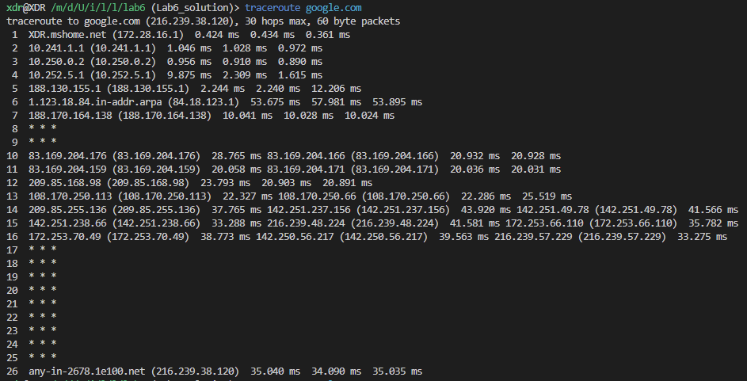
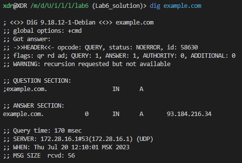

# Operating System Analysis

Context

OS: Windows 10

## Task 1

### Analyze disk space

1. System propmt
   

2. get-volume prompt
   

3. chkdsk C:
   Всего единиц распределения на диске: 121933052.
   Доступно единиц распределения на диске: 40292161.
   

### Inodes Anakysis

On windows 10 in is possible to get wil following snippet
fsutil file queryfileid .\Windows\
ИД файла: 0x00000000000000000001000000000663

### Resource Consumption Analysis

Using windows it is possible to use Winows Task manager to check the performance of the resource consumption.
CPU

RAM

- Observations and insights:
  Google Chrome is a very good web browser to kill all resources available.
