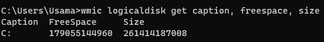
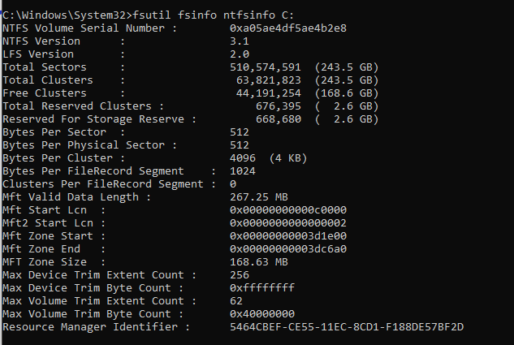
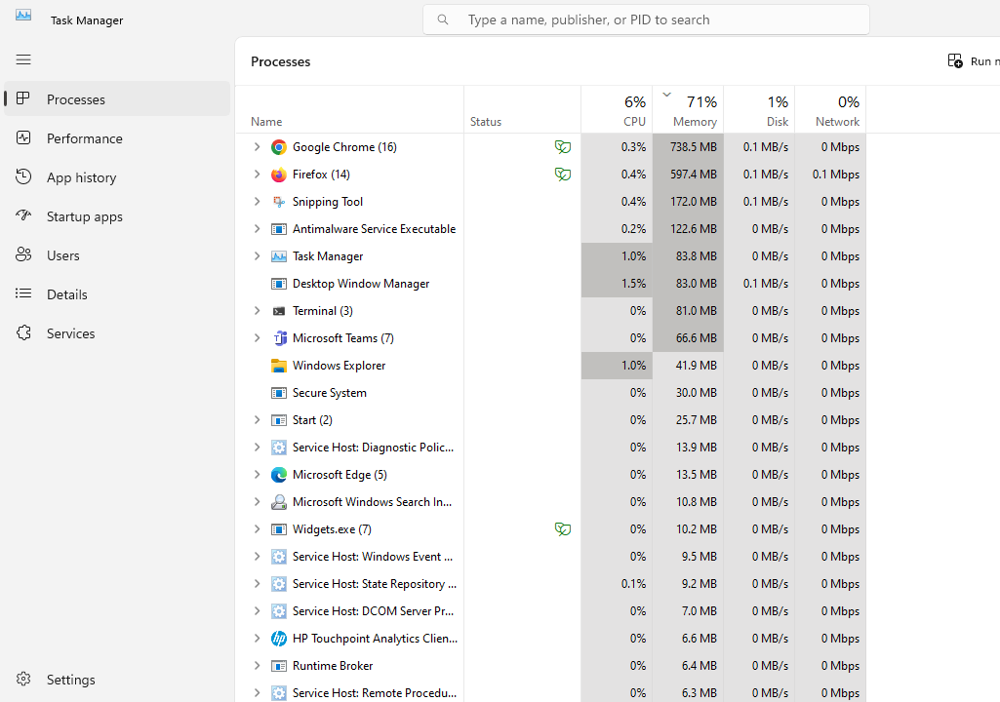
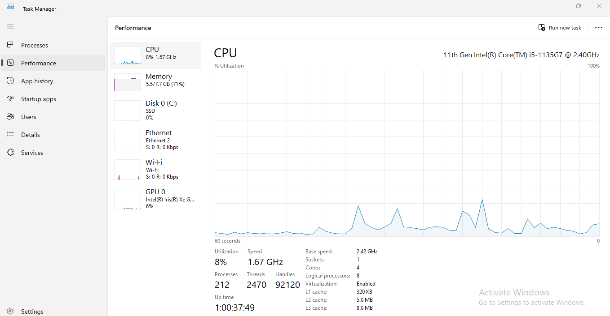
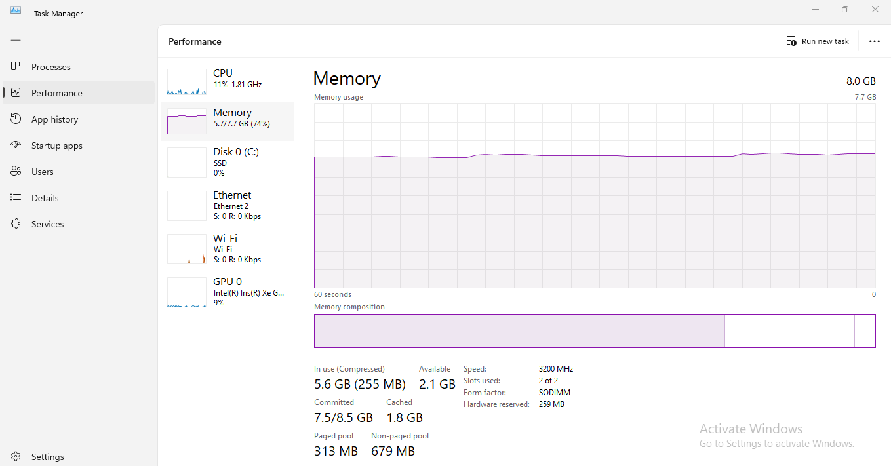

# Operating Systems & Networking Lab

## Task 1: Operating System Analysis

## 1. Analyze Disk Space:
To check the available disk space on my operating system I used the following command:

> wmic logicaldisk get caption, freespace, size

**Output:**

## 2. Inodes Analysis:

To check the Inodes on my operating system I used the following command:

> fsutil fsinfo ntfsinfo C:

**Output:**

Please note that the concept of inodes is specific to Unix-like file systems such as ext4, and Windows uses a different file system structure. The **fsutil** command provides information about the NTFS file system used in Windows, but it does not directly display the number of inodes. Instead, it provides information about clusters, which are the allocation units used by NTFS.

## 3. Resource Consumption Analysis:

To identify the process consuming the most RAM and CPU on my operating system, I did not use any command I just check from task manager because I am using Windows Opreating system:
1. Go on search bar and search for Task Manager
2. In the Task Manager window, you will see several tabs, like CPU, Memory, Disk and Network.

**Output:**

In Task Manager we can Check the performance of CPU and RAM as well.

