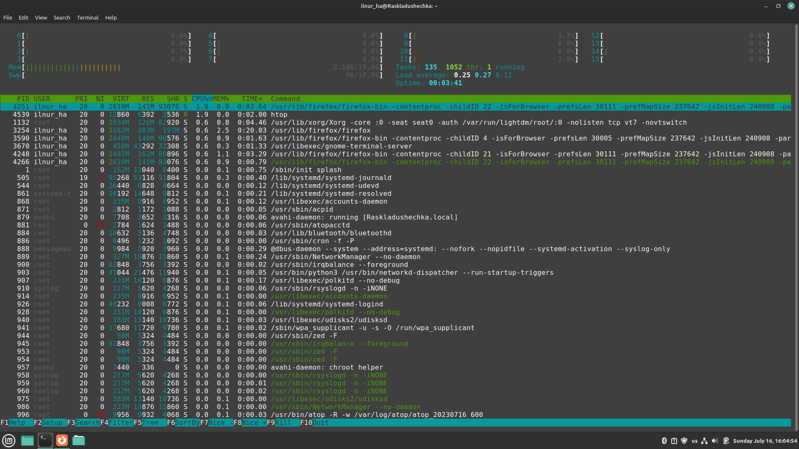
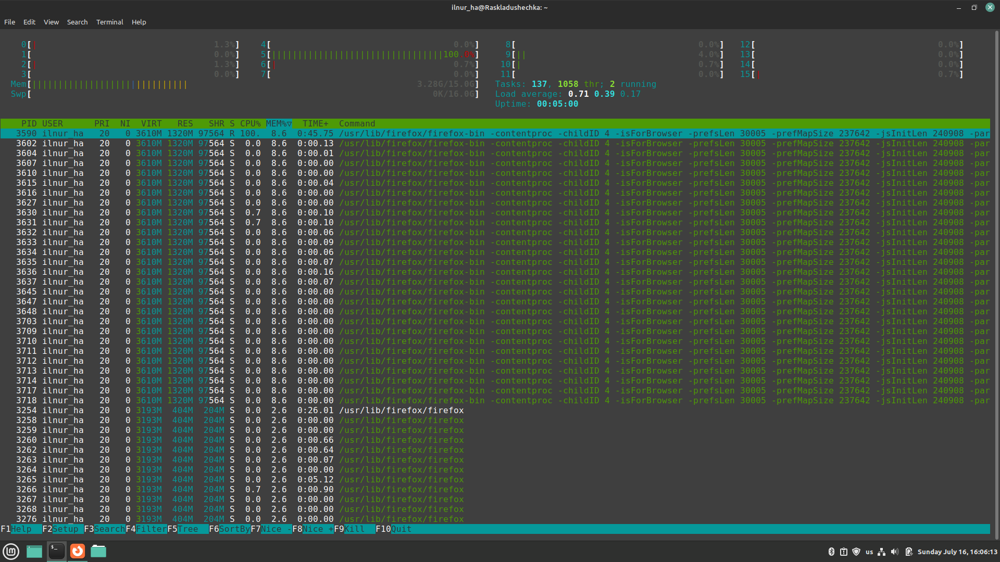

# Disk Space Analysis

---

## Available disk space

### Command

> `df -H`

### Output

> ```Filesystem               Size  Used Avail Use% Mounted on
> tmpfs                    1,7G  2,7M  1,7G   1% /run
> /dev/nvme0n1p6            74G   52G   19G  75% /
> tmpfs                    8,1G  4,1k  8,1G   1% /dev/shm
> tmpfs                    5,3M  4,1k  5,3M   1% /run/lock
> /dev/nvme0n1p7           120G   47G   67G  42% /home
> /dev/nvme0n1p1           1,1G   39M  1,1G   4% /boot/efi
> tmpfs                    1,7G  119k  1,7G   1% /run/user/1000
> /home/ilnur_ha/.Private  120G   47G   67G  42% /home/ilnur_ha

## Inodes Analysis

### Command

> `df -Hi`

### Output

> ```Filesystem              Inodes IUsed IFree IUse% Mounted on
> tmpfs                     2,0M  1,2k  2,0M    1% /run
> /dev/nvme0n1p6            4,6M  1,4M  3,3M   29% /
> tmpfs                     2,0M     2  2,0M    1% /dev/shm
> tmpfs                     2,0M     5  2,0M    1% /run/lock
> /dev/nvme0n1p7            7,5M  470k  7,1M    7% /home
> /dev/nvme0n1p1               0     0     0     - /boot/efi
> tmpfs                     393k   116  393k    1% /run/user/1000
> /home/ilnur_ha/.Private   7,5M  470k  7,1M    7% /home/ilnur_ha

## Resource Consumption analysis

### Command

> `htop`

### Output

To sort processes by RAM or CPU consumption,
you should tap F6, then choose needed resource
to sort by

This command is showing processes in real time.
Quitting, just returns to the terminal

#### CPU consumption

</img>

#### RAM consumption

