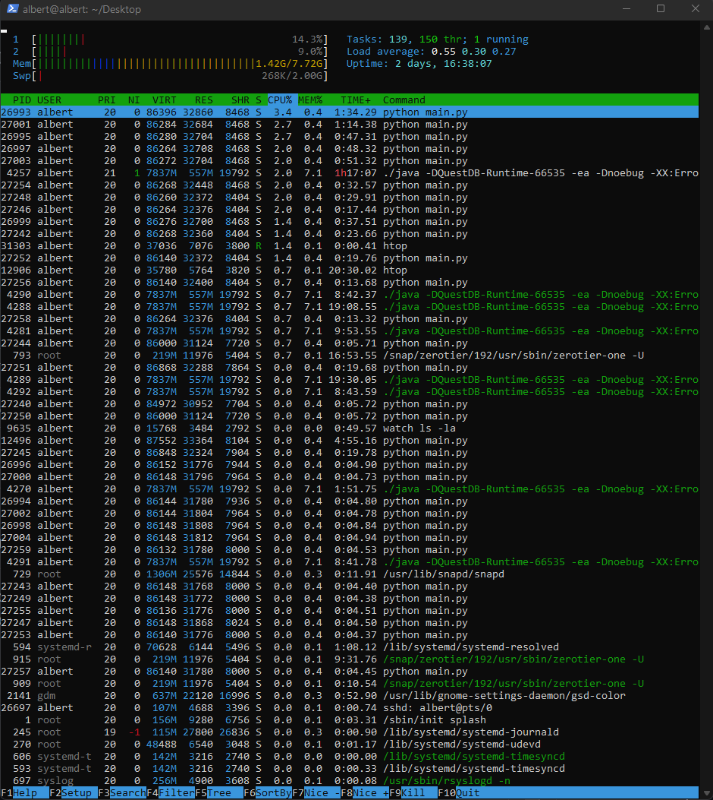

# Lab6: Operating Systems & Networking Lab

- Zeyad Alagamy
- Bs-Cs-01
- z.alagamy@innopolis.university

## 1. Operating System Analysis

### 1.1 Analyze Disk Space:

- The command used is `df -h`
- Command details: according to the [docs](https://linux.die.net/man/1/df):

> `df` displays the amount of disk space available on the file system containing each file name argument. If no file name is given, the space available on all currently mounted file systems is shown.

> `-h` for human readability.

- Usage:

```bash
$ df -h

Filesystem      Size  Used Avail Use% Mounted on
tmpfs           773M  2.7M  771M   1% /run
/dev/nvme0n1p5  110G   93G   12G  89% /
tmpfs           3.8G   16M  3.8G   1% /dev/shm
tmpfs           5.0M  4.0K  5.0M   1% /run/lock
/dev/nvme0n1p1   96M   81M   16M  85% /boot/efi
/dev/sda1       489G  380G  110G  78% /mnt/01D7C50FFEEFD1F0
tmpfs           773M  144K  773M   1% /run/user/1000
/dev/sda2       130G  127G  3.7G  98% /media/xp/Innopolis
/dev/sda3       121G   14G  108G  12% /media/xp/Innopolis1
```

### 1.2 Inodes Analysis:

- The command used is `df -i`
- Command details: according to the [docs](https://linux.die.net/man/1/df):

> -i, --inodes : list inode information instead of block usage

- Usage:

```bash
$ df -i

Filesystem        Inodes   IUsed     IFree IUse% Mounted on
tmpfs             989391    1778    987613    1% /run
/dev/nvme0n1p5   7348224 1590467   5757757   22% /
tmpfs             989391      61    989330    1% /dev/shm
tmpfs             989391       4    989387    1% /run/lock
/dev/nvme0n1p1         0       0         0     - /boot/efi
/dev/sda1      114968444  470261 114498183    1% /mnt/01D7C50FFEEFD1F0
tmpfs             197878     171    197707    1% /run/user/1000
/dev/sda2        3876784    6211   3870573    1% /media/xp/Innopolis
/dev/sda3      112904924  166907 112738017    1% /media/xp/Innopolis1

```

### 1.3 Resource Consumption Analysis:

- The command used is `htop`
- Command details: `htop` provides an interactive and more user-friendly process viewer. By default processes are sorted based on `CPU usage`. But you can simily click on `MEM%` to list based on memory usage.

- Usage:

```bash
$ htop
```



- Observations:
  - Looks like I am out of memeory )
