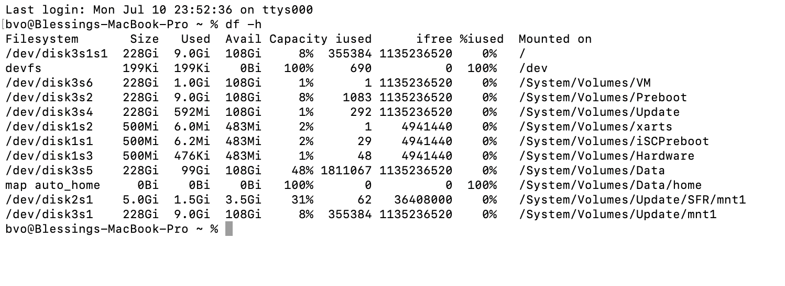
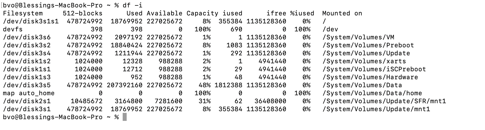
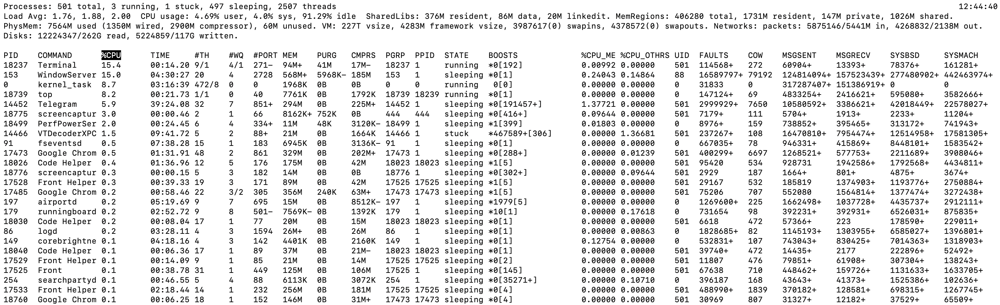

# Task 1: Operating System Analysis

## Analyze Disk Space

### System : MacOS

### Command : `df -h`

### Output :

#

## Inodes Analysis

### System : MacOS

### Command : `df -i`

### Output :

#

## Resource Consumption Analysis

### System : MacOS

### Command : `top`

### Output :

