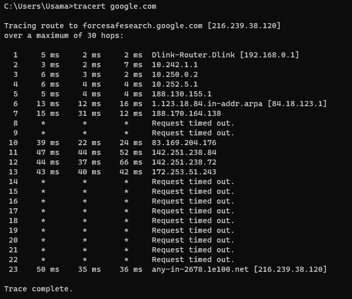
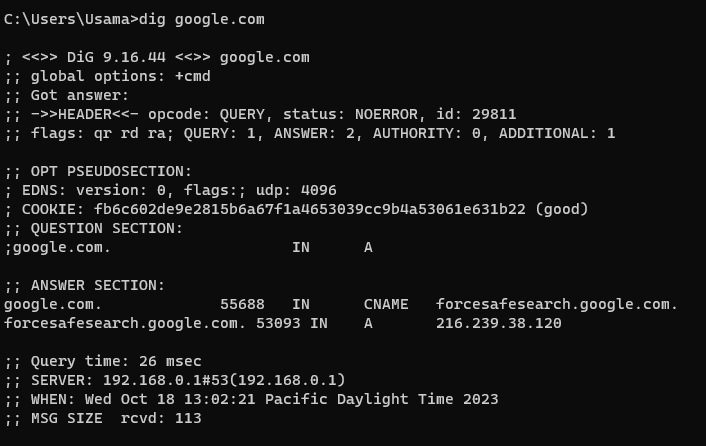

# Task 2: Networking Analysis

## 1. Traceroute

Traceroute is a network diagnostic tool that helps trace the path of network packets from a source device to a destination. By sending packets with increasing TTL values and recording the IP addresses of intermediate routers, traceroute provides insights into the network path and latency. It is commonly used to troubleshoot network connectivity issues, identify potential bottlenecks, and analyze the performance of network connections.

I used the following command for Traceroute:

>tracert google.com

**output**

### Insights and Observations of Traceroute
1. Sometime *** will apear in the result of the traceroute command, after searching for the answer, here is my findings about this phonomena:

In the traceroute command, the "" represents a timeout or lack of response from a particular network hop along the traceroute path. It indicates that the ICMP (Internet Control Message Protocol) Echo Request packets sent to that hop did not receive a response within the specified time limit. This could occur due to various reasons, such as network congestion, firewall configurations, or routers configured to block ICMP traffic. The appearance of "" suggests that further investigation may be required to understand the network behavior at that specific hop. 

2. Identifying Bottlenecks: By analyzing the traceroute output, you can identify network hops with consistently higher latency or increased packet loss.

## 2. Dig

The dig command is a DNS (Domain Name System) diagnostic tool used to perform DNS queries and retrieve information about domain names. It allows users to query DNS servers to obtain details such as IP addresses, MX (Mail Exchange) records, and other DNS-related information for a specific domain. dig sends a DNS query to a specified DNS server and receives a response containing the requested DNS records. This tool is commonly used for DNS troubleshooting, verifying DNS configurations, and obtaining DNS information for domain names.

I used the following command for DIG:

>dig google.com

**output**

### Insights and Observations of Dig:
1. dig allows you to perform DNS lookups and verify if a domain name can be resolved to an IP address. It helps validate DNS settings and ensures that domain names are properly mapped to the intended IP addresses. 
2. The dig command provides information about various DNS records associated with a domain name, such as A (IPv4 address), AAAA (IPv6 address), MX (mail exchange), CNAME (canonical name), NS (name server), and more. By using the dig command, you can retrieve specific DNS records and gain insights into the domain's DNS configuration.
