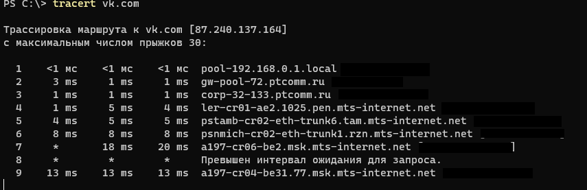
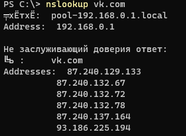

# Networking Analysis

## Traceroute

`tracert vk.com`
By sending ICMP (Internet Control Protocol) echo packets to the target, TRACERT diagnostic software ascertains the route to the location. In these packets, TRACERT use various IP Time To Live (TTL) values. The TTL value functions as a hop counter since each router along the way must decrement the packet's TTL field by at least 1 before forwarding the packet.

## Digging

`nslookup vk.com`  

Non-authoritative answer defenition:
When using the nslookup utility to query Domain Name System (DNS) servers, you could see the message “Non-authoritative answer.” This tells you that the DNS server you’re asking can’t ensure that it has the official, up-to-date information for the domain name or IP address you’re seeking up and is instead giving you a cached response that it got from another DNS server.
