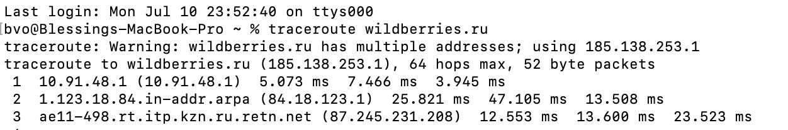
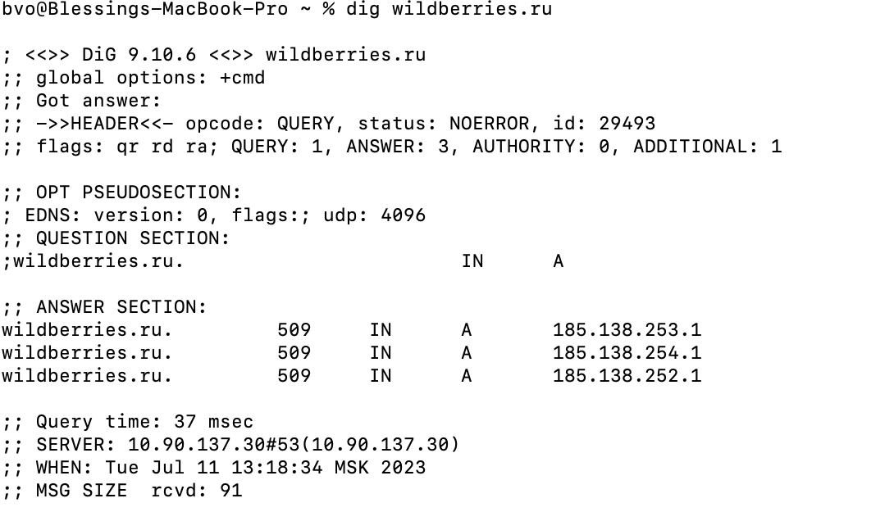

# Task 2: Networking Analysis

## Traceroute Analysis:

### System : MacOS

### Command : `traceroute wildberries.ru`

### Output :

### Observarion :

- The traceroute output shows the network path from the source to the destination, which is wildberries.ru (IP address: 185.138.253.1).
- The first hop (10.91.48.1) is within the local network and has a relatively low latency.
- The second hop (84.18.123.1) is a gateway that connects the local network to the wider internet. The latency increased compared to the previous hop.
- The third hop (87.245.231.208) is a router operated by the internet service provider (ISP). It is part of the RETN network. The latency remained relatively stable compared to the previous hop.

## Dig Analysis:

### System : MacOS

### Command : `traceroute wildberries.ru`

### Output :

### Observarion :

- The dig output shows the DNS lookup for the domain name wildberries.ru.

- The ANSWER SECTION provides three IP addresses associated with the domain: 185.138.253.1, 185.138.254.1, and 185.138.252.1. This indicates that the domain has multiple A records pointing to different IP addresses.
- The Query time of 37 msec indicates the time it took for the DNS query to receive a response.
- The SERVER field displays the DNS server used for the query, which in this case is 10.90.137.30.
