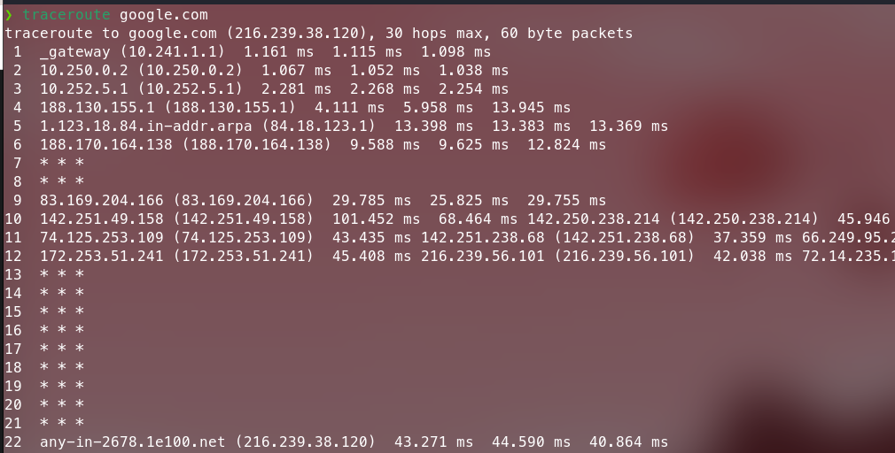
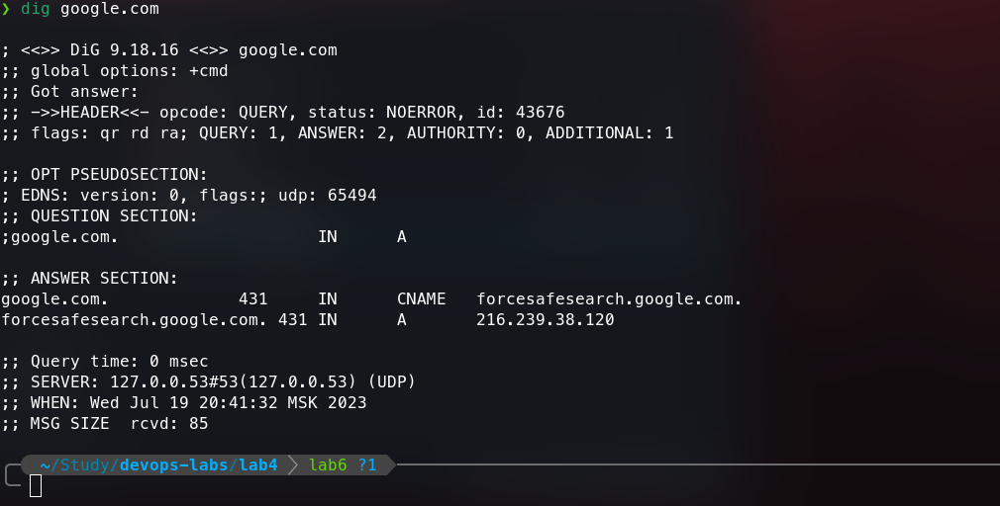

# Traceroute Analysis

## Traceroute
1. First, we need to install traceroute (in case you do not have it) on Fedora
    ```bash
    sudo dnf update
    sudo dnf install traceroute
    ```
2. We can use following command to traceroute website
    ```bash
    traceroute <web-url>
    ```

For example, let us traceroute google.com

```bash
traceroute google.com
```

### Result


### Observations
1. Each line indicates a router hop. The first column shows the hop number.

2. The following three columns show the round-trip time (RTT) for a total of three packets:
- For nearby networks, these numbers are usually below 100ms.
- For distant networks in other countries, typical RTT values go up to 300ms.

Three asterisk symbols (\* \* \*) instead of numbers followed by a "Request timed out" message can indicate:
- The router is down.
- The router is configured not to return traceroute results.
- A firewall is enabled on the router.
- A time-out for one of the previous routers.

3. The last column displays the destination IP address and, whenever possible, the resolved domain name.

## Dig
1. First, we need to install dig
    ```bash
    sudo dnf update
    sudo dnf install dig
    ```
2. We can use following command to perform DNS lookup
    ```bash
    dig <web-url>
    ```

For example, let us dig google.com again ;)

```bash
dig google.com
```

### Result


### Observations
The most important section is the ANSWER section:

- The first column lists the name of the server that was queried
- The second column is the Time to Live, a set timeframe after which the record is refreshed
- The third column shows the class of query – in this case, “IN” stands for Internet
- The fourth column displays the type of query – in this case, “A” stands for an A (address) record
- The final column displays the IP address associated with the domain name
