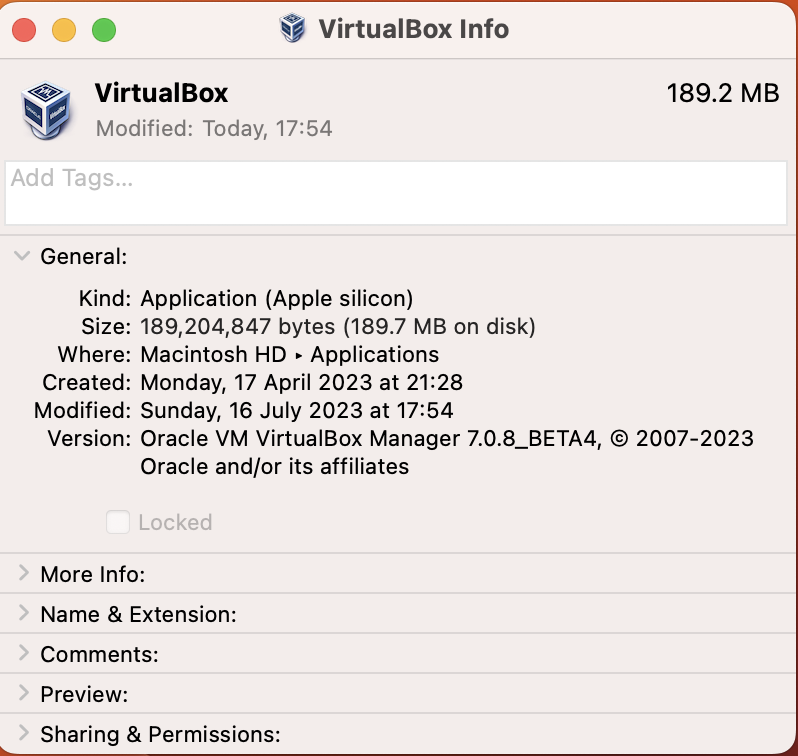
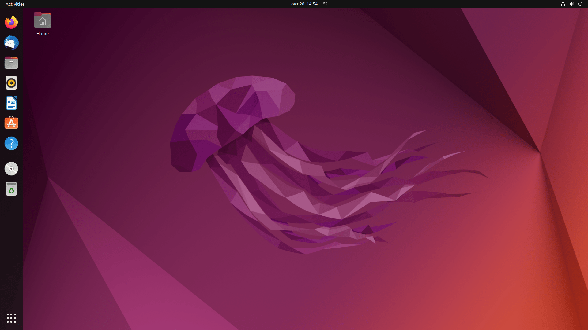
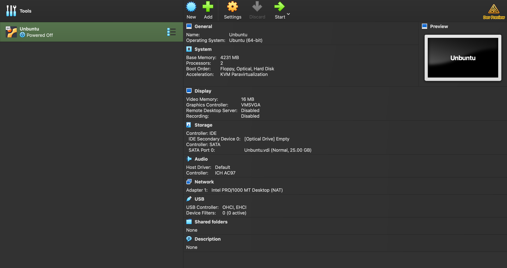
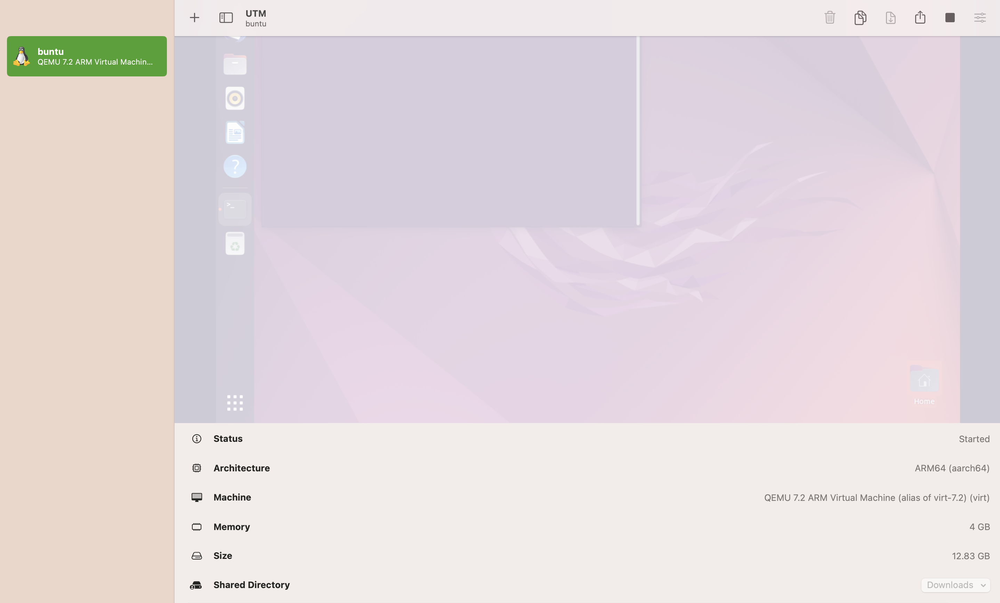

# Task 1: VM Deployment

## 1. Installing a VirtualBox:

- ### version 7.0.8
  

#

## 2. Deploying a Virtual Machine:

### Steps I followed to deploy the VM:

- I Downloaded Ubuntu from https://ubuntu.com/download/desktop.
- I Opened VirtualBox and clicked on New.
- I Selected the location of the iso image.

### VM Settings:

### Screenshot of the VM running

- I got errors while trying to run ubuntu from **VirtualBox** and when I did research on it I found out that for macOs with M1 or M2 Mac Apple Silicon,VirtualBox is not really compatible with it, so I found **UTM** (https://mac.getutm.app/) which I downloaded and was compatible with ubuntu for my M2 (https://ubuntu.com/download/server/arm).

