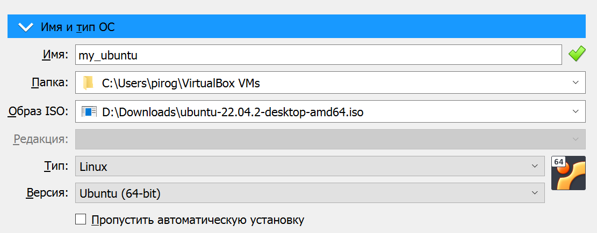
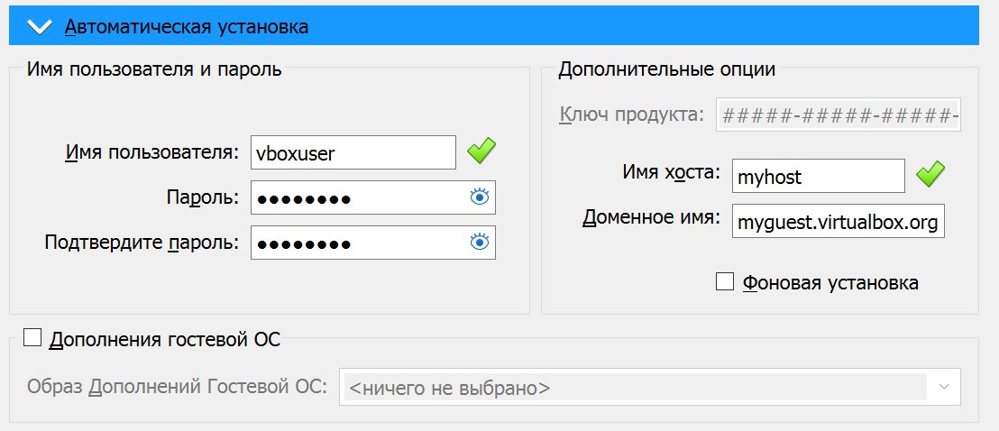
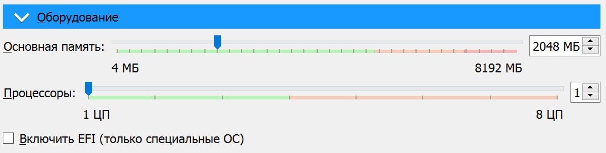
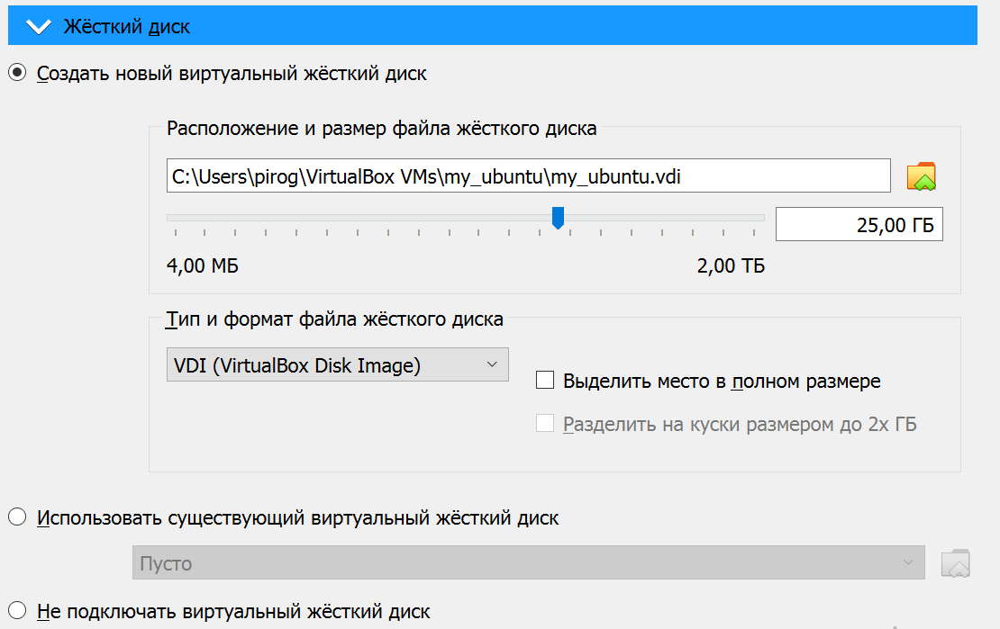
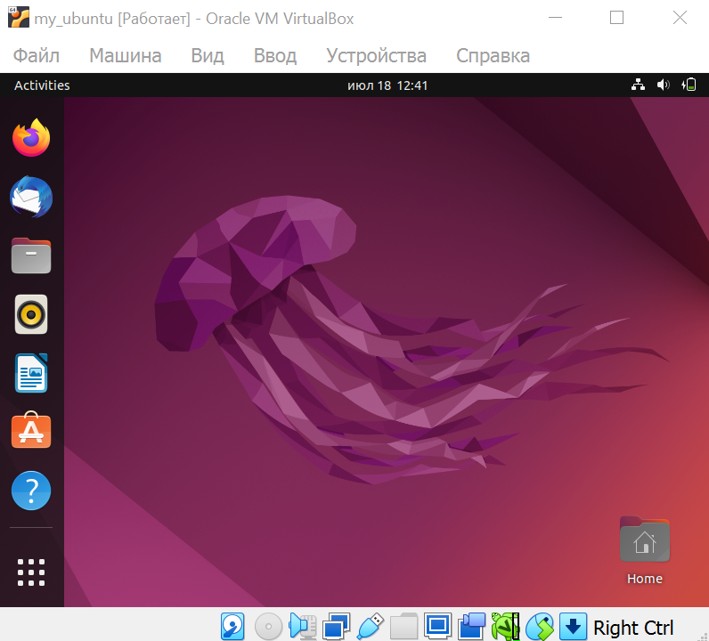

# Virtualization Lab

## Task 1: VM Deployment
1. Install VirtualBox:
   - Download and install VirtualBox for Windows from the official website
   - VirtualBox version is 7.0.8 r156879 (Qt5.15.2)

2. Deploy a Virtual Machine:
    - Download iso file of Ubuntu 22 from the official website
    - Configure and run a VM

      
      
      
      
      


## Task 2: System Information Tools
1. Processor, RAM, and Network Information:
- **Processor Information**
```
lscpu
> Architecture:            x86_64
> CPU op-mode(s):        32-bit, 64-bit
> Address sizes:         44 bits physical, 48 bits virtual
> Byte Order:            Little Endian
> CPU(s):                  4
> On-line CPU(s) list:   0-3
> Vendor ID:               AuthenticAMD
> Model name:            AMD Ryzen 5 4600HS with Radeon Graphics
> CPU family:          23
> Model:               96
> Thread(s) per core:  2
> Core(s) per socket:  6
> Socket(s):           1
> Stepping:            1
> Frequency boost:     enabled
> CPU max MHz:         3000.0000
> CPU min MHz:         1400.0000
> BogoMIPS:            5989.14
> Flags:               fpu vme de pse tsc msr pae mce cx8 apic sep mtrr pge mca cmov pat pse36 clflush m
> mx fxsr sse sse2 ht syscall nx mmxext fxsr_opt pdpe1gb rdtscp lm constant_tsc rep
> _good nopl nonstop_tsc cpuid extd_apicid aperfmperf rapl pni pclmulqdq monitor ss
> se3 fma cx16 sse4_1 sse4_2 movbe popcnt aes xsave avx f16c rdrand lahf_lm cmp_leg
> acy svm extapic cr8_legacy abm sse4a misalignsse 3dnowprefetch osvw ibs skinit wd
> t tce topoext perfctr_core perfctr_nb bpext perfctr_llc mwaitx cpb cat_l3 cdp_l3
> hw_pstate ssbd mba ibrs ibpb stibp vmmcall fsgsbase bmi1 avx2 smep bmi2 cqm rdt_a
> rdseed adx smap clflushopt clwb sha_ni xsaveopt xsavec xgetbv1 xsaves cqm_llc cq
> m_occup_llc cqm_mbm_total cqm_mbm_local clzero irperf xsaveerptr rdpru wbnoinvd c
> ppc arat npt lbrv svm_lock nrip_save tsc_scale vmcb_clean flushbyasid decodeassis
> ts pausefilter pfthreshold avic v_vmsave_vmload vgif v_spec_ctrl umip rdpid overf
> low_recov succor smca sev sev_es
> Virtualization features:
> Virtualization:        AMD-V
> Caches (sum of all):     
> L1d:                   192 KiB (6 instances)
> L1i:                   192 KiB (6 instances)
> L2:                    3 MiB (6 instances)
> L3:                    8 MiB (2 instances)
> NUMA:                    
> NUMA node(s):          4
> NUMA node0 CPU(s):     0-3
> Vulnerabilities:         
> Itlb multihit:         Not affected
> L1tf:                  Not affected
> Mds:                   Not affected
> Meltdown:              Not affected
> Mmio stale data:       Not affected
> Retbleed:              Mitigation; untrained return thunk; SMT enabled with STIBP protection
> Spec store bypass:     Mitigation; Speculative Store Bypass disabled via prctl
> Spectre v1:            Mitigation; usercopy/swapgs barriers and __user pointer sanitization
> Spectre v2:            Mitigation; Retpolines, IBPB conditional, STIBP always-on, RSB filling, PBRSB-eIB
> RS Not affected
> Srbds:                 Not affected
> Tsx async abort:       Not affected
```
- **RAM Information**
```
free
>                total        used        free      shared  buff/cache   available
> Mem:           1.9Gi       1.2Gi       0.7Gi       238Mi       1.2Gi       0.8Gi
> Swap:          0.0Gi          0B       0.0Gi
```
- **Network Information**
```
ip
> 1: lo: <LOOPBACK,UP,LOWER_UP> mtu 65536 qdisc noqueue state UNKNOWN group default qlen 1000
>     link/loopback 00:00:00:00:00:00 brd 00:00:00:00:00:00
>     inet 127.0.0.1/8 scope host lo
>        valid_lft forever preferred_lft forever
>     inet6 ::1/128 scope host
>        valid_lft forever preferred_lft forever
> 2: enp0s3: <BROADCAST,MULTICAST,UP,LOWER_UP> mtu 1500 qdisc fq_codel state UP group default qlen 1000
>     link/ether 08:00:27:f6:0d:5e brd ff:ff:ff:ff:ff:ff
>     inet 10.0.2.15/24 brd 10.0.2.255 scope global dynamic noprefixroute enp0s3
>        valid_lft 86232sec preferred_lft 86232sec
>     inet6 fe80::a00:27ff:fef6:d5e/64 scope link
>        valid_lft forever preferred_lft forever
```

2. Operating System Specifications:
```
lsb_release -a
> No LSB modules are available.
> Distributor ID: Ubuntu
> Description:    Ubuntu 22.04 LTS
> Release:        22.04
> Codename:       jammy
```
