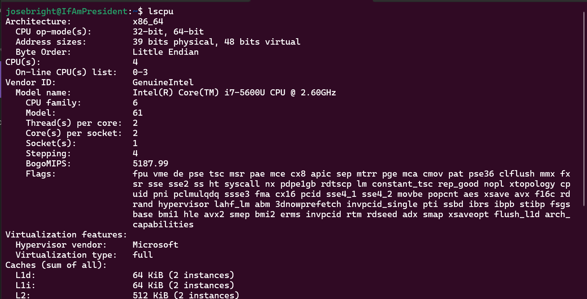
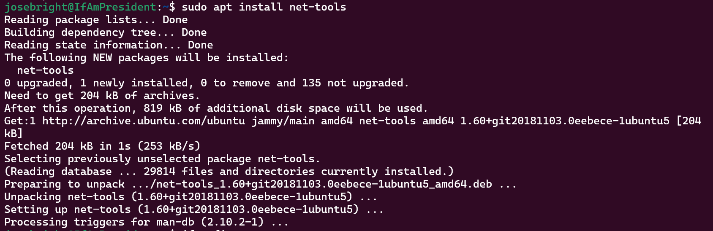
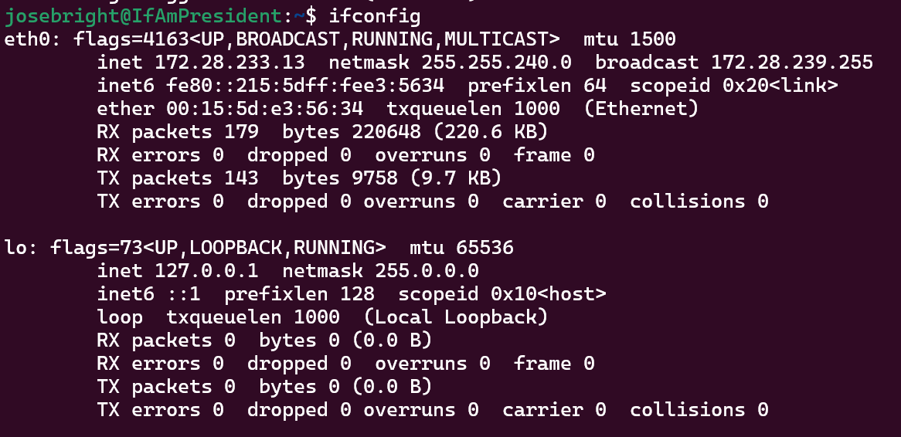

## Task 2: System Information Tools

To display system information, you can use various commands on Ubuntu. Below is some of the commonly used commands for displaying processor, RAM, network, and operating system information:

### Processor Information:

The `lscpu` command can be used to display processor information. This command provides detailed information about the CPU architecture, vendor, model name, CPU MHz, cache size, and more.

```
lscpu
```


### RAM Information:

The `free` command can be used to display RAM information. This command provides information about the total, used, and free memory available in the system.
```
free -h
```


### Network Information:

The `ifconfig` command can be used to display network information. This command provides information about the network interfaces, IP addresses, and other network-related information. However, you need to install `inet-tools` first.

```
sudo apt install net-tools
ifconfig
```



### Operating System Specifications:

The `lsb_release` command can be used to display operating system specifications. This command provides information about the distribution ID, release, and codename.

```
lsb_release -a
```
