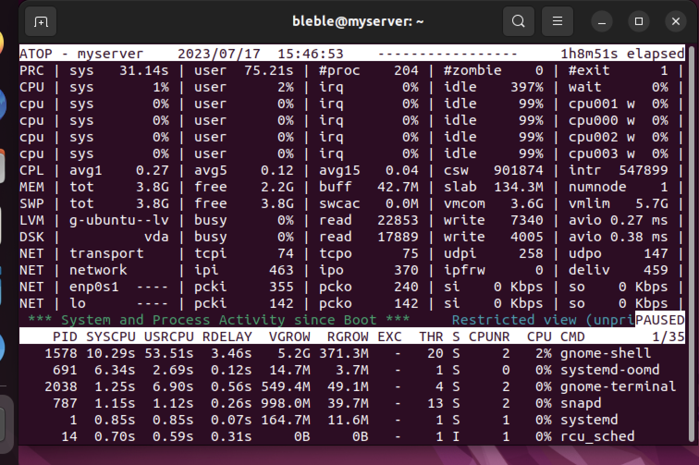
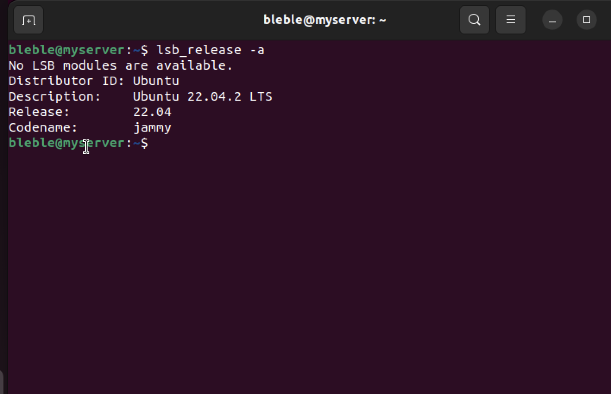

# Task 2: System Information Tools

## 1. Processor, RAM, and Network Information:

- ### I installed atop: `sudo apt install atop`

### To get:

- processor information,
- view RAM (memory) information,
- and Network information,

just use the `atop` commmand and all the above information will display.

#

#

## 2. Operating System Specifications:

`lsb_release -a`

