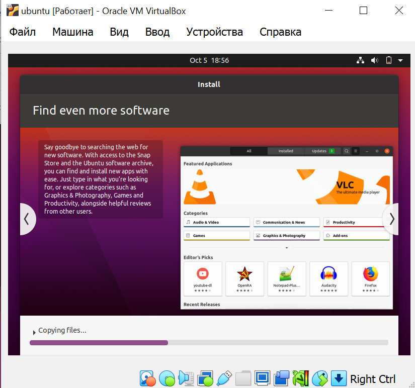
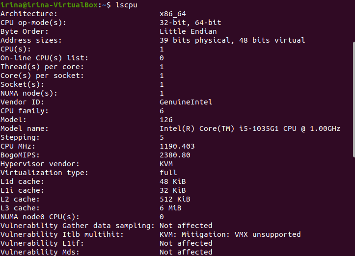
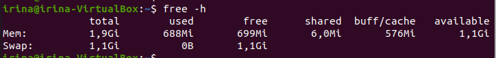
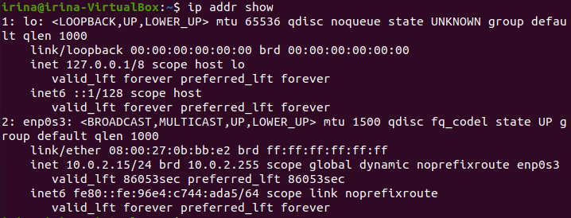
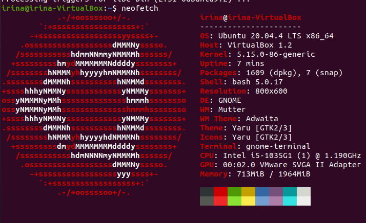

## VM installation

1. Download from the link: https://download.virtualbox.org/virtualbox/7.0.10/VirtualBox-7.0.10-158379-Win.exe
2. VM version: 7.0.10
3. Choose downloaded ISO Ubuntu 20.04
4. Choose RAM of 4 GB, 1 CPU processor, 25 GB hard drive memory

## System Information
1. Processor, RAM, and Network Information:
Command for checking the processor:

    lscpu

Output:

Command for checking the RAM:

    free -h

Output:

Command for checking the Network Information:

    ip addr show

Output:

2. Operating System Specifications:
Command:

    neofetch

Output:

    

