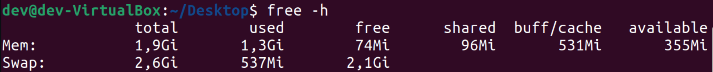
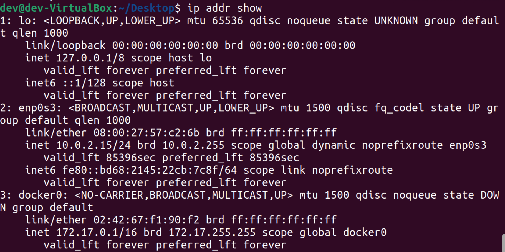
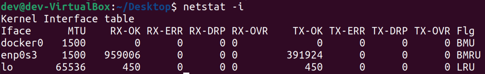
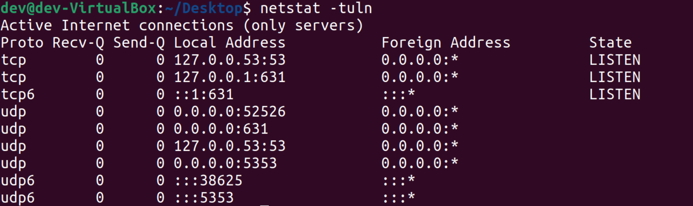

### Task 2: System Information Tools

> Important: Those information which is not fitting in one screenshot are copy-pasted from teminal to the Markdown file in the text format.

## 1. Processor

# To check the processor model and basic information:
> lscpu

```sh 
Architecture:            x86_64
  CPU op-mode(s):        32-bit, 64-bit
  Address sizes:         39 bits physical, 48 bits virtual
  Byte Order:            Little Endian
CPU(s):                  3
  On-line CPU(s) list:   0-2
Vendor ID:               GenuineIntel
  Model name:            Intel(R) Core(TM) i5-8257U CPU @ 1.40GHz
    CPU family:          6
    Model:               142
    Thread(s) per core:  1
    Core(s) per socket:  3
    Socket(s):           1
    Stepping:            10
    BogoMIPS:            2791.19
    Flags:               fpu vme de pse tsc msr pae mce cx8 apic sep mtrr pge mc
                         a cmov pat pse36 clflush mmx fxsr sse sse2 ht syscall n
                         x rdtscp lm constant_tsc rep_good nopl xtopology nonsto
                         p_tsc cpuid tsc_known_freq pni pclmulqdq ssse3 cx16 pci
                         d sse4_1 sse4_2 x2apic movbe popcnt aes xsave avx rdran
                         d hypervisor lahf_lm abm 3dnowprefetch invpcid_single p
                         ti fsgsbase bmi1 avx2 bmi2 invpcid rdseed clflushopt md
                         _clear flush_l1d arch_capabilities
Virtualization features: 
  Hypervisor vendor:     KVM
  Virtualization type:   full
Caches (sum of all):     
  L1d:                   96 KiB (3 instances)
  L1i:                   96 KiB (3 instances)
  L2:                    768 KiB (3 instances)
  L3:                    18 MiB (3 instances)
NUMA:                    
  NUMA node(s):          1
  NUMA node0 CPU(s):     0-2
Vulnerabilities:         
  Itlb multihit:         KVM: Mitigation: VMX unsupported
  L1tf:                  Mitigation; PTE Inversion
  Mds:                   Mitigation; Clear CPU buffers; SMT Host state unknown
  Meltdown:              Mitigation; PTI
  Mmio stale data:       Mitigation; Clear CPU buffers; SMT Host state unknown
  Retbleed:              Vulnerable
  Spec store bypass:     Vulnerable
  Spectre v1:            Mitigation; usercopy/swapgs barriers and __user pointer
                          sanitization
  Spectre v2:            Mitigation; Retpolines, STIBP disabled, RSB filling, PB
                         RSB-eIBRS Not affected
  Srbds:                 Unknown: Dependent on hypervisor status
  Tsx async abort:       Not affected
```

# To get detailed information about the processor architecture:
> cat /proc/cpuinfo

```sh
processor  : 0
vendor_id  : GenuineIntel
cpu family  : 6
model    : 142
model name  : Intel(R) Core(TM) i5-8257U CPU @ 1.40GHz
stepping  : 10
cpu MHz    : 1395.596
cache size  : 6144 KB
physical id  : 0
siblings  : 3
core id    : 0
cpu cores  : 3
apicid    : 0
initial apicid  : 0
fpu    : yes
fpu_exception  : yes
cpuid level  : 22
wp    : yes
flags    : fpu vme de pse tsc msr pae mce cx8 apic sep mtrr pge mca cmov pat pse36 clflush mmx fxsr sse sse2 ht syscall nx rdtscp lm constant_tsc rep_good nopl xtopology nonstop_tsc cpuid tsc_known_freq pni pclmulqdq ssse3 cx16 pcid sse4_1 sse4_2 x2apic movbe popcnt aes xsave avx rdrand hypervisor lahf_lm abm 3dnowprefetch invpcid_single pti fsgsbase bmi1 avx2 bmi2 invpcid rdseed clflushopt md_clear flush_l1d arch_capabilities
bugs    : cpu_meltdown spectre_v1 spectre_v2 spec_store_bypass l1tf mds swapgs itlb_multihit srbds mmio_stale_data retbleed
bogomips  : 2791.19
clflush size  : 64
cache_alignment  : 64
address sizes  : 39 bits physical, 48 bits virtual
power management:

processor  : 1
vendor_id  : GenuineIntel
cpu family  : 6
model    : 142
model name  : Intel(R) Core(TM) i5-8257U CPU @ 1.40GHz
stepping  : 10
cpu MHz    : 1395.596
cache size  : 6144 KB
physical id  : 0
siblings  : 3
core id    : 1
cpu cores  : 3
apicid    : 1
initial apicid  : 1
fpu    : yes
fpu_exception  : yes
cpuid level  : 22
wp    : yes
flags    : fpu vme de pse tsc msr pae mce cx8 apic sep mtrr pge mca cmov pat pse36 clflush mmx fxsr sse sse2 ht syscall nx rdtscp lm constant_tsc rep_good nopl xtopology nonstop_tsc cpuid tsc_known_freq pni pclmulqdq ssse3 cx16 pcid sse4_1 sse4_2 x2apic movbe popcnt aes xsave avx rdrand hypervisor lahf_lm abm 3dnowprefetch invpcid_single pti fsgsbase bmi1 avx2 bmi2 invpcid rdseed clflushopt md_clear flush_l1d arch_capabilities
bugs    : cpu_meltdown spectre_v1 spectre_v2 spec_store_bypass l1tf mds swapgs itlb_multihit srbds mmio_stale_data retbleed
bogomips  : 2791.19
clflush size  : 64
cache_alignment  : 64
address sizes  : 39 bits physical, 48 bits virtual
power management:

processor  : 2
vendor_id  : GenuineIntel
cpu family  : 6
model    : 142
model name  : Intel(R) Core(TM) i5-8257U CPU @ 1.40GHz
stepping  : 10
cpu MHz    : 1395.596
cache size  : 6144 KB
physical id  : 0
siblings  : 3
core id    : 2
cpu cores  : 3
apicid    : 2
initial apicid  : 2
fpu    : yes
fpu_exception  : yes
cpuid level  : 22
wp    : yes
flags    : fpu vme de pse tsc msr pae mce cx8 apic sep mtrr pge mca cmov pat pse36 clflush mmx fxsr sse sse2 ht syscall nx rdtscp lm constant_tsc rep_good nopl xtopology nonstop_tsc cpuid tsc_known_freq pni pclmulqdq ssse3 cx16 pcid sse4_1 sse4_2 x2apic movbe popcnt aes xsave avx rdrand hypervisor lahf_lm abm 3dnowprefetch invpcid_single pti fsgsbase bmi1 avx2 bmi2 invpcid rdseed clflushopt md_clear flush_l1d arch_capabilities
bugs    : cpu_meltdown spectre_v1 spectre_v2 spec_store_bypass l1tf mds swapgs itlb_multihit srbds mmio_stale_data retbleed
bogomips  : 2791.19
clflush size  : 64
cache_alignment  : 64
address sizes  : 39 bits physical, 48 bits virtual
power management:
```

## 2. RAM (Memory) Information:

# To check the total available memory and usage statistics:
> free -h



# To view more detailed memory information:
> cat /proc/meminfo

```sh
MemTotal:        2010124 kB
MemFree:           82952 kB
MemAvailable:     372852 kB
Buffers:           19300 kB
Cached:           462364 kB
SwapCached:        23380 kB
Active:           455928 kB
Inactive:        1085268 kB
Active(anon):     266100 kB
Inactive(anon):   886848 kB
Active(file):     189828 kB
Inactive(file):   198420 kB
Unevictable:          16 kB
Mlocked:              16 kB
SwapTotal:       2744316 kB
SwapFree:        2178560 kB
Zswap:                 0 kB
Zswapped:              0 kB
Dirty:             19576 kB
Writeback:             0 kB
AnonPages:       1051876 kB
Mapped:           284524 kB
Shmem:             99084 kB
KReclaimable:      66040 kB
Slab:             171136 kB
SReclaimable:      66040 kB
SUnreclaim:       105096 kB
KernelStack:       11632 kB
PageTables:        24380 kB
NFS_Unstable:          0 kB
Bounce:                0 kB
WritebackTmp:          0 kB
CommitLimit:     3749376 kB
Committed_AS:    5960280 kB
VmallocTotal:   34359738367 kB
VmallocUsed:       45184 kB
VmallocChunk:          0 kB
Percpu:             3904 kB
HardwareCorrupted:     0 kB
AnonHugePages:         0 kB
ShmemHugePages:        0 kB
ShmemPmdMapped:        0 kB
FileHugePages:         0 kB
FilePmdMapped:         0 kB
HugePages_Total:       0
HugePages_Free:        0
HugePages_Rsvd:        0
HugePages_Surp:        0
Hugepagesize:       2048 kB
Hugetlb:               0 kB
DirectMap4k:      171968 kB
DirectMap2M:     1925120 kB
```

## 3. Network Information:

# To check network interfaces and their status:
> ip addr show



# To get network statistics and routing information:

> Important: For this part we need to install netstat:
> sudo apt install net-tools

> netstat -i



# To check active network connections:

> netstat -tuln

