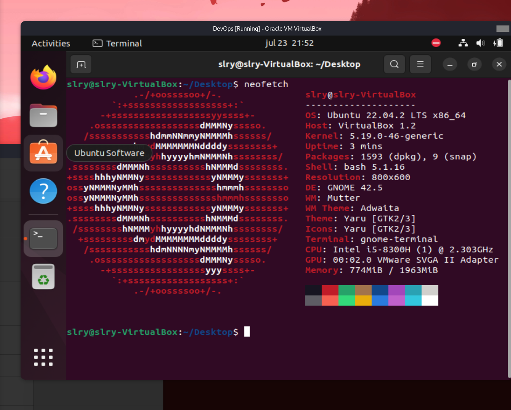
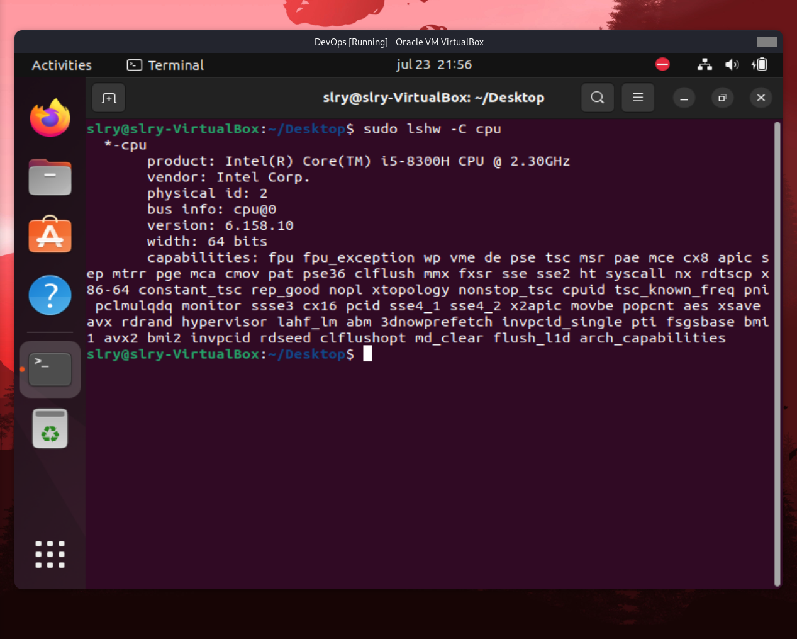
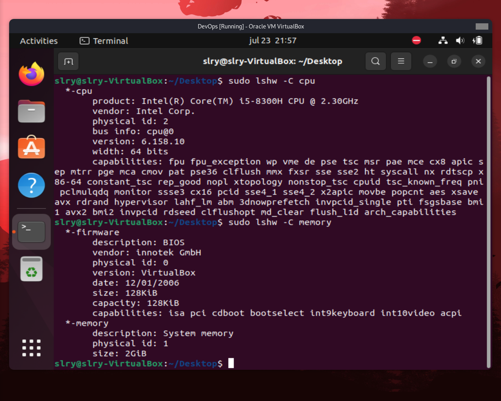
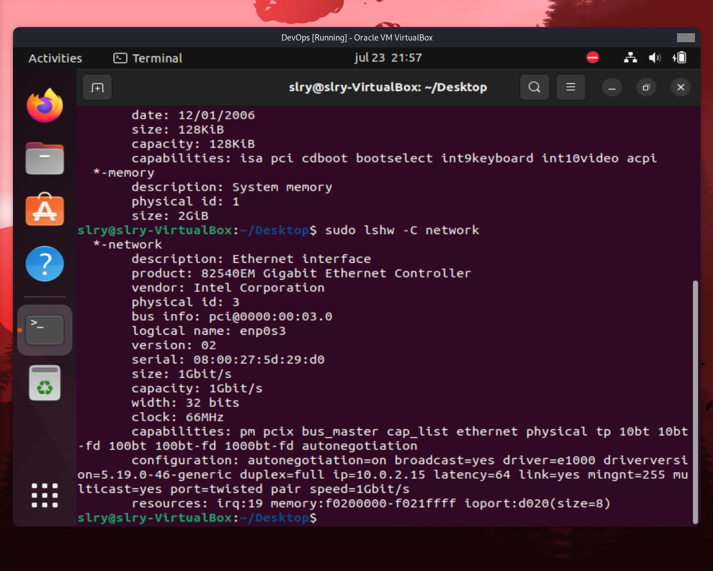
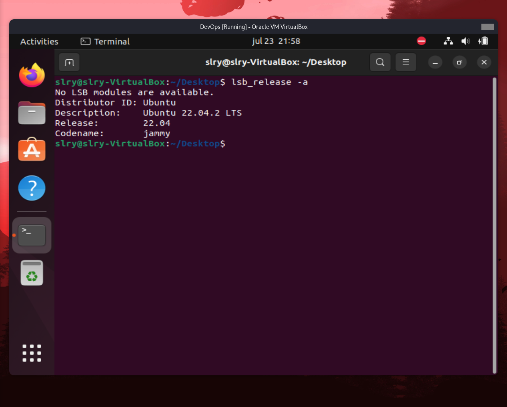

# VM Ubuntu System Information

## Install lshw
```bash
sudo apt-get install lshw
```



## Display Processor Information
```bash
sudo lshw -C cpu
```



## Display RAM Information
```bash
sudo lshw -C memory
```



## Display Network Information
```bash
sudo lshw -C network
```



## Display Operating System Specifications
```bash
lsb_release -a
```


