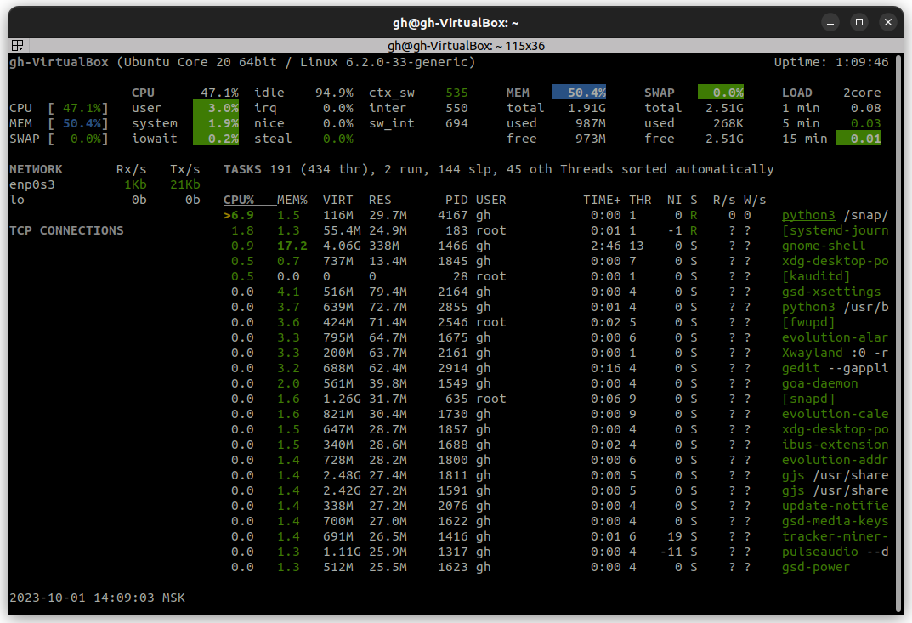

# 1. System Information Tools (Processor, RAM, and Network Information)


## Display Processor Information

 - usin the following command `lscpu` 
    - Output :

        ```ruby
        Architecture:            x86_64
        CPU op-mode(s):        32-bit, 64-bit
        Address sizes:         39 bits physical, 48 bits virtual
        Byte Order:            Little Endian
        CPU(s):                  2
        On-line CPU(s) list:   0,1
        Vendor ID:               GenuineIntel
        Model name:            11th Gen Intel(R) Core(TM) i5-11300H @ 3.10GHz
            CPU family:          6
            Model:               140
            Thread(s) per core:  1
            Core(s) per socket:  2
            Socket(s):           1
            Stepping:            1
            BogoMIPS:            6220.80
            Flags:               fpu vme de pse tsc msr pae mce cx8 apic sep mtrr pge mca cmov pat pse36 clflush mmx fxsr sse sse2
                                ht syscall nx rdtscp lm constant_tsc rep_good nopl xtopology nonstop_tsc cpuid tsc_known_freq pn
                                i pclmulqdq ssse3 cx16 pcid sse4_1 sse4_2 x2apic movbe popcnt aes xsave avx rdrand hypervisor lah
                                f_lm abm 3dnowprefetch invpcid_single pti fsgsbase avx2 invpcid rdseed clflushopt md_clear flush_
                                l1d arch_capabilities
        Virtualization features: 
        Hypervisor vendor:     KVM
        Virtualization type:   full
        Caches (sum of all):     
        L1d:                   96 KiB (2 instances)
        L1i:                   64 KiB (2 instances)
        L2:                    2.5 MiB (2 instances)
        L3:                    16 MiB (2 instances)
        NUMA:                    
        NUMA node(s):          1
        NUMA node0 CPU(s):     0,1
        Vulnerabilities:         
        Gather data sampling:  Unknown: Dependent on hypervisor status
        Itlb multihit:         KVM: Mitigation: VMX unsupported
        L1tf:                  Mitigation; PTE Inversion
        Mds:                   Mitigation; Clear CPU buffers; SMT Host state unknown
        Meltdown:              Mitigation; PTI
        Mmio stale data:       Not affected
        Retbleed:              Not affected
        Spec store bypass:     Vulnerable
        Spectre v1:            Mitigation; usercopy/swapgs barriers and __user pointer sanitization
        Spectre v2:            Mitigation; Retpolines, STIBP disabled, RSB filling, PBRSB-eIBRS Not affected
        Srbds:                 Not affected
        Tsx async abort:       Not affected

        ```
- for displaying the proccess currently runnin use the following: `htop --sort-key=PERCENT_CPU`
    - Output:

         


## Display RAM Information


- using the command  `free -h` 
    - Output:
        ```c++
                    total        used        free      shared  buff/cache   available
        Mem:           1.9Gi       792Mi       164Mi        33Mi       1.0Gi       972Mi
        Swap:          2.5Gi          0B       2.5Gi
        ```

## Display Network Information


- Install net-tools

    - `sudo apt update`
    - `sudo apt install net-tools`
- Using the command  `ifconfig` 
    - Output:

        ```ruby
        enp0s3: flags=4163<UP,BROADCAST,RUNNING,MULTICAST>  mtu 1500
                inet 10.0.2.15  netmask 255.255.255.0  broadcast 10.0.2.255
                inet6 fe80::c66d:5f64:de78:f0e1  prefixlen 64  scopeid 0x20<link>
                ether 08:00:27:7a:9e:ca  txqueuelen 1000  (Ethernet)
                RX packets 21147  bytes 22290367 (22.2 MB)
                RX errors 0  dropped 0  overruns 0  frame 0
                TX packets 7315  bytes 1521125 (1.5 MB)
                TX errors 0  dropped 0 overruns 0  carrier 0  collisions 0

        lo: flags=73<UP,LOOPBACK,RUNNING>  mtu 65536
                inet 127.0.0.1  netmask 255.0.0.0
                inet6 ::1  prefixlen 128  scopeid 0x10<host>
                loop  txqueuelen 1000  (Local Loopback)
                RX packets 218  bytes 19692 (19.6 KB)
                RX errors 0  dropped 0  overruns 0  frame 0
                TX packets 218  bytes 19692 (19.6 KB)
                TX errors 0  dropped 0 overruns 0  carrier 0  collisions 0
        ```


# 2: System Information Tools (Operating System Specifications)

- install thetool using `sudo apt-get install inxi`
- `inxi -F`
    - Output:

        ```ruby
        System:
        Host: gh-VirtualBox Kernel: 6.2.0-33-generic x86_64 bits: 64 Console: pty pts/0
            Distro: Ubuntu 22.04.3 LTS (Jammy Jellyfish)
        Machine:
        Type: Virtualbox System: innotek GmbH product: VirtualBox v: 1.2 serial: <superuser required>
        Mobo: Oracle model: VirtualBox v: 1.2 serial: <superuser required> BIOS: innotek GmbH
            v: VirtualBox date: 12/01/2006
        Battery:
        ID-1: BAT0 charge: 50.0 Wh (100.0%) condition: 50.0/50.0 Wh (100.0%) volts: 10.0 min: 10.0
        CPU:
        Info: dual core model: 11th Gen Intel Core i5-11300H bits: 64 type: MCP cache: L2: 2.5 MiB
        Speed (MHz): avg: 3110 min/max: N/A cores: 1: 3110 2: 3110
        Graphics:
        Device-1: VMware SVGA II Adapter driver: vmwgfx v: 2.20.0.0
        Display: server: X.org v: 1.21.1.4 with: Xwayland v: 22.1.1 driver: gpu: vmwgfx
            note:  X driver n/a tty: 122x34
        Message: GL data unavailable in console. Try -G --display
        Audio:
        Device-1: Intel 82801AA AC97 Audio driver: snd_intel8x0
        Sound Server-1: ALSA v: k6.2.0-33-generic running: yes
        Sound Server-2: PulseAudio v: 15.99.1 running: yes
        Sound Server-3: PipeWire v: 0.3.48 running: yes
        Network:
        Device-1: Intel 82540EM Gigabit Ethernet driver: e1000
        IF: enp0s3 state: up speed: 1000 Mbps duplex: full mac: 08:00:27:7a:9e:ca
        Device-2: Intel 82371AB/EB/MB PIIX4 ACPI type: network bridge driver: piix4_smbus
        Drives:
        Local Storage: total: 24 GiB used: 12.4 GiB (51.7%)
        ID-1: /dev/sda vendor: VirtualBox model: VBOX HARDDISK size: 24 GiB
        Partition:
        ID-1:  size: 22.96 GiB used: 12.39 GiB (54.0%) fs: ext4 dev: /dev/sda3
        ID-2: /boot/efi size: 512 MiB used: 6.1 MiB (1.2%) fs: vfat dev: /dev/sda2
        Swap:
        ID-1: swap-1 type: file size: 2.51 GiB used: 0 KiB (0.0%) file: /swapfile
        Sensors:
        Message: No sensor data found. Is lm-sensors configured?
        Info:
        Processes: 190 Uptime: 45m Memory: 1.91 GiB used: 990.4 MiB (50.5%) Init: systemd runlevel: 5
        Shell: Bash inxi: 3.3.13
        ```


# 3: System Information Tools (other tools)

**1. bpytop**

- `sudo snap install bpytop` 
- `bpytop` 
    - Output :
    


**2. glances**

- `sudo snap install glances` 
- `glances`
    - Output :
    


 > I used ssh to connect to the virtual machine: `ssh gh@127.0.0.1 -p 2222`
