# System Information Tools

---

## Processor, RAM, Network

### Processor

Input: `lscpu`

Output:

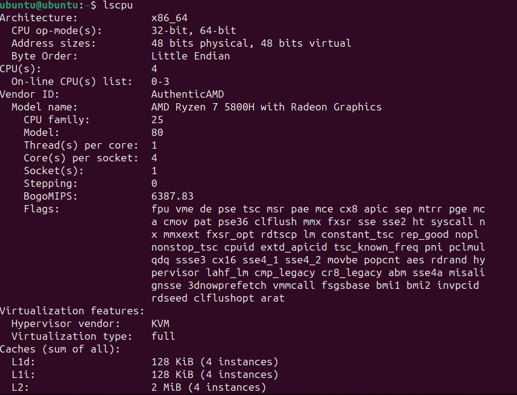</img>

### RAM

Input: `free -h`

Output:

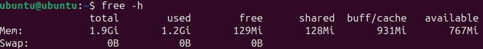</img>

### Network

Input: `ifconfig`

Output:

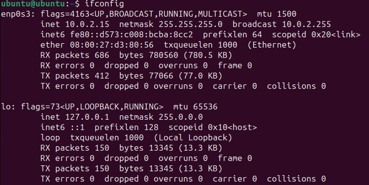</img>

To use `ifconfig` you need net-tools:

> `sudo apt install net-tools`

## Operating System Specification

Input: `lshw`

Output:

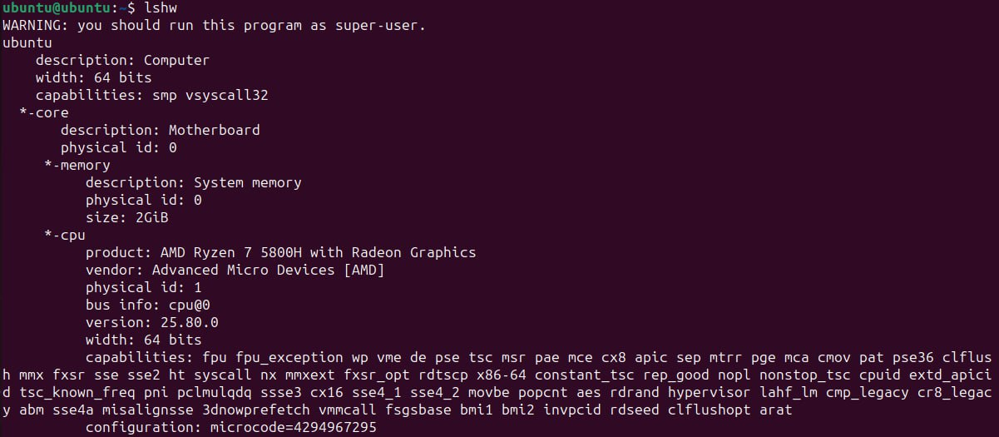</img>

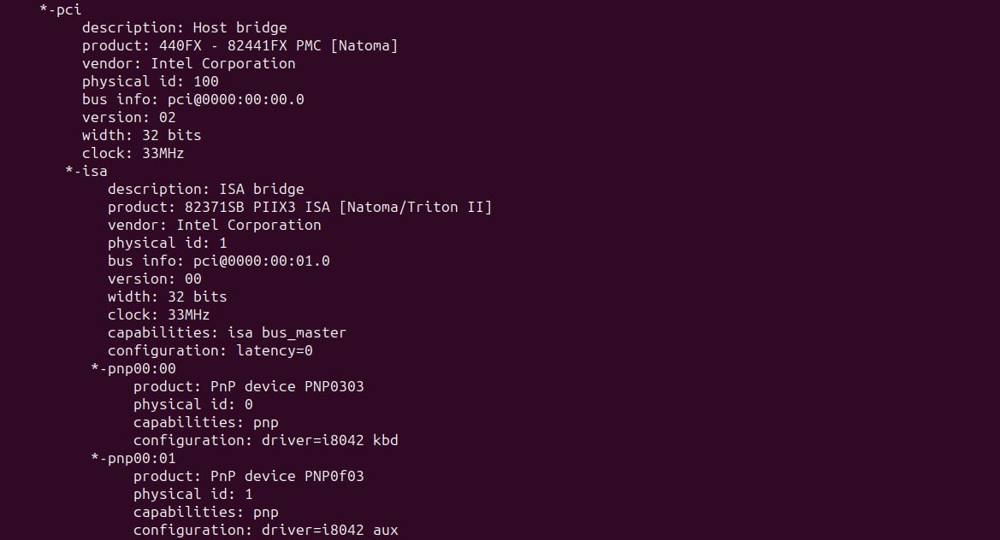</img>

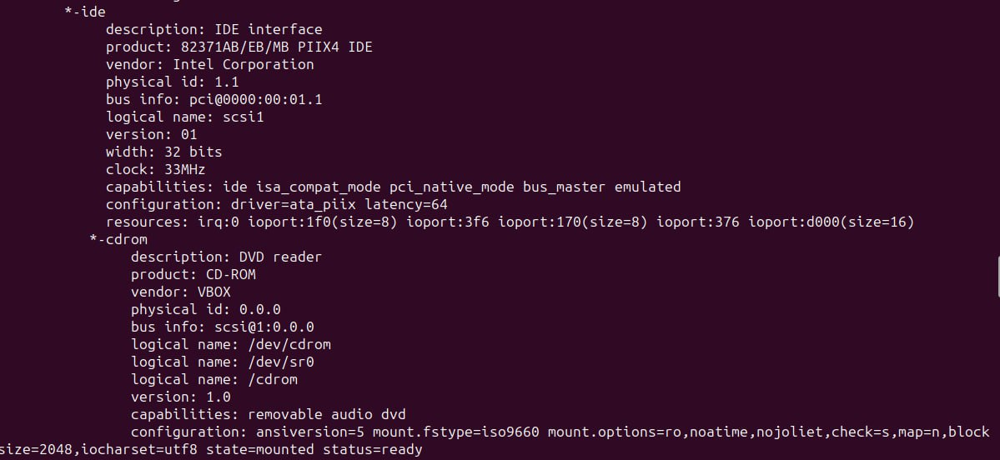</img>

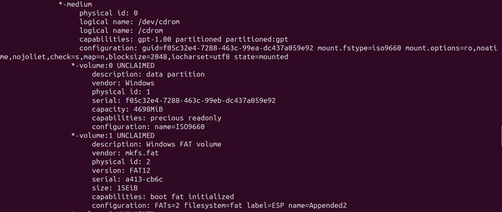</img>

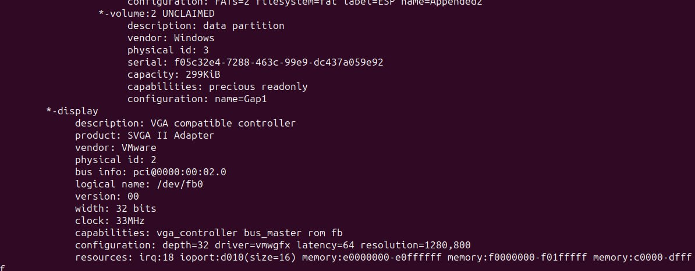</img>

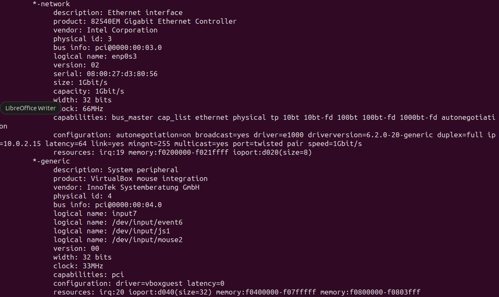</img>

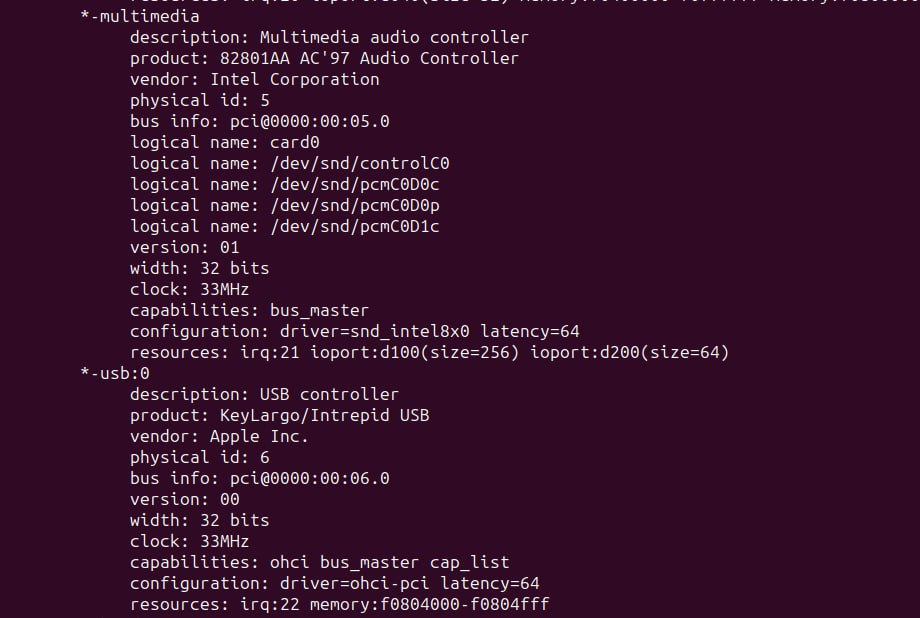</img>

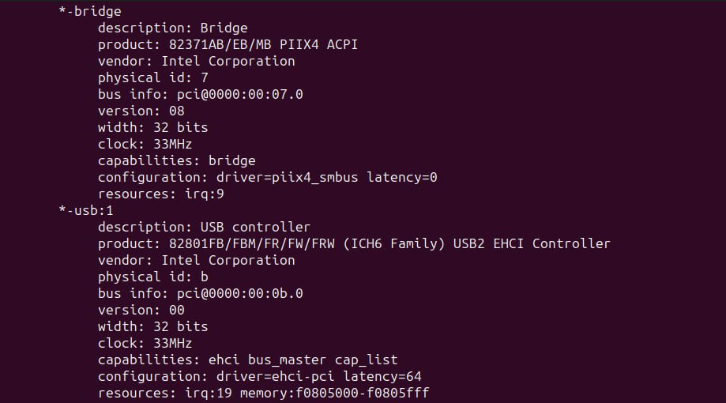</img>

</img>

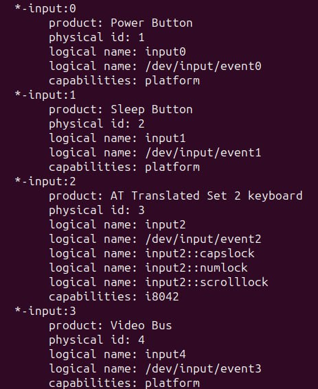</img>

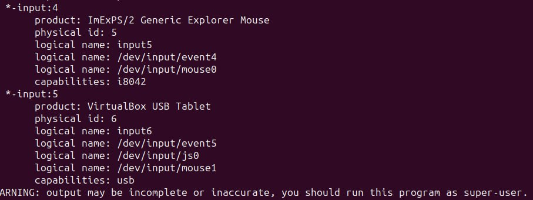</img>

