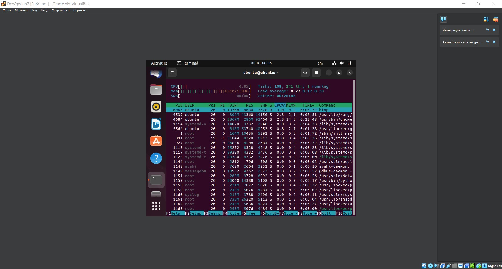
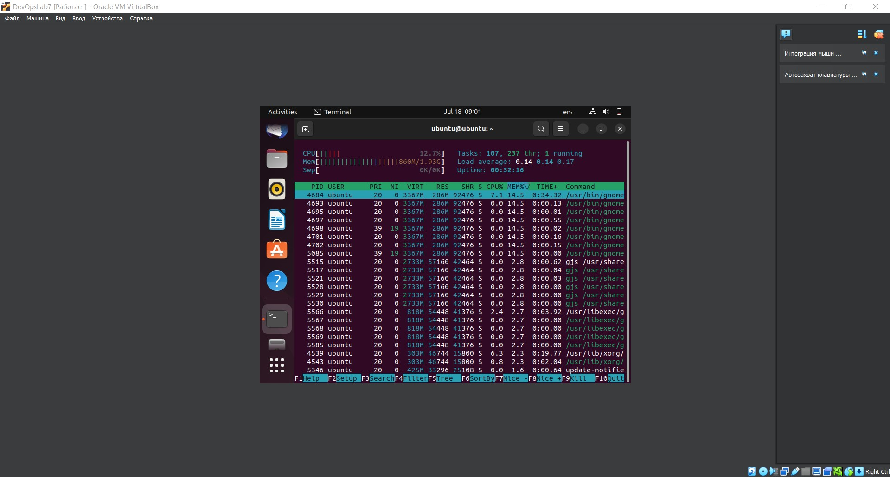
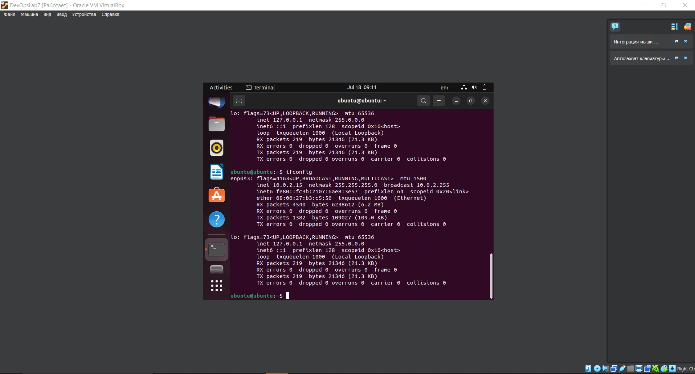

# System Information Tools

## Install htop

``` shell
sudo apt-get update
sudo apt-get install htop
```

## Display Processor Information

``` shell
htop
```



## Display RAM Information

``` shell
htop --sort-key PERCENT_MEM
```



## Install net-tools

``` shell
sudo apt update
sudo apt install net-tools
```

## Display Network Information

``` shell
ifconfig
```



## Observations
I need to install additiional tool to obtain network information. Probably `atop` is better in this aspect, because it contains all information in one place.