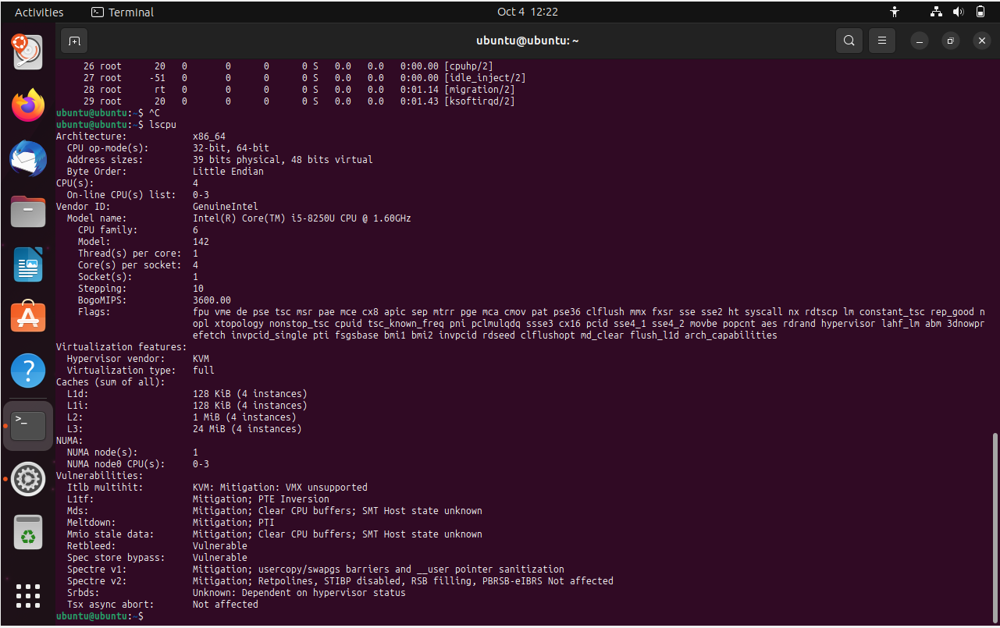
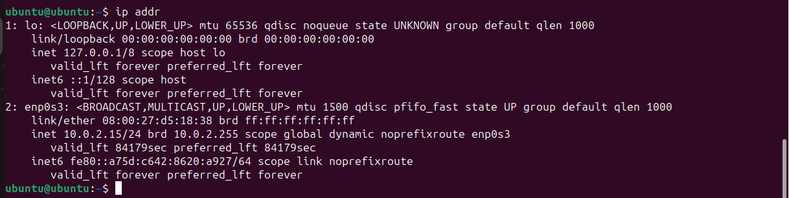
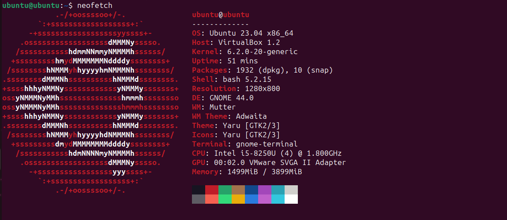

# Task 2: Sytem Info

### 1. RAM

- To check the CPU information I used the command `lscpu`:

    

- To check the RAM information I used the command `free -h`:

    

- To check the network interfaces and their status I used the command `ip addr`:

    

### 2. Operating System Specifications

To display information about operating system specifications I used the command `neofetch`, but before running this command I ran `sudo apt update` and then `sudo apt install neofetch`.

