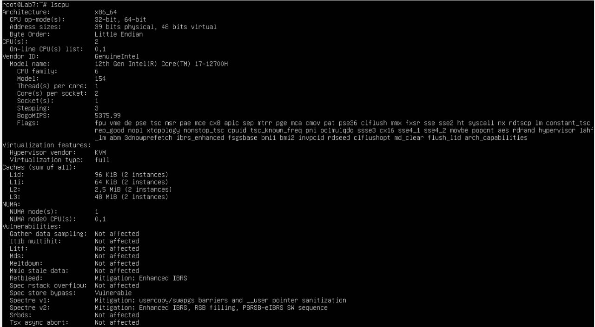
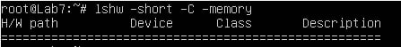
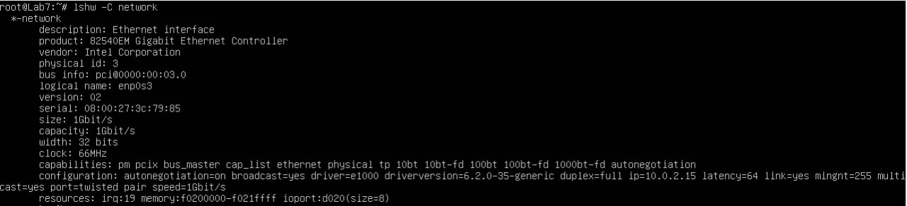
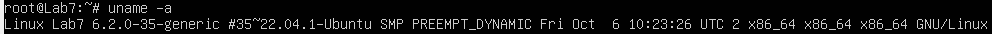

1. I used the command "lscpu" and got this output:

2. I used command "lshw -short -C memory" and got result:

3. I used command "lshw -C network"

4. To get os info, I used command 'uname -a". Got:

