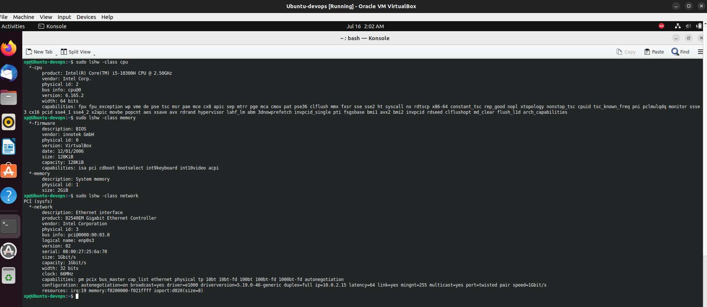
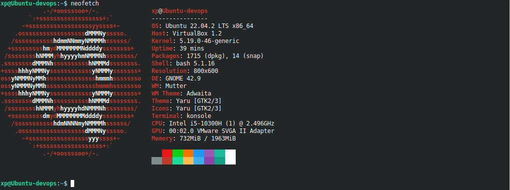

# Lab7: Virtualization Lab

- Zeyad Alagamy
- BS-CS-01
- z.alagamy@innopolis.university

## 2.1 Processor, RAM, and Network Information:

I will use one command which is `lshw` but with different flags as follows
`lshw -class <cpu | memory | network>`

### For `CPU`:

```bash
$ lshw -class cpu
```

### For `RAM`:

```bash
$ lshw -class memory
```

### For `Network Info`:

```bash
$ lshw -class network
```

### VM System details



## 2.2 Operating System Specifications:

- `neofetch` is a popular tool used to retrieve and display system information in a visually appealing way.

- I hade to install it on my new vm

```bash
$ sudo apt-get update
$ sudo apt-get full-upgrade
$ sudo apt-get install neofetch
```

- Then we can show the sys info:

```bash
$ neofetch
```

- Output:

