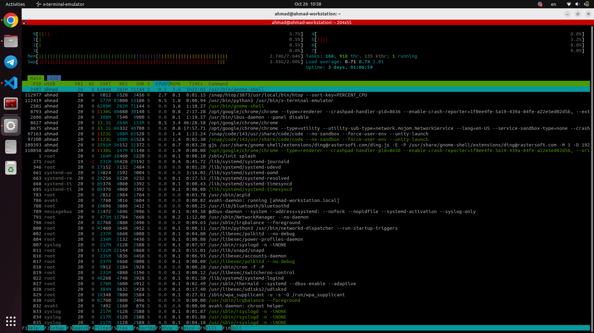

## Display Processor Information

 - command: 
 ```ruby
 ahmad@ahmad-workstation:~$ lscpu
Architecture:            x86_64
  CPU op-mode(s):        32-bit, 64-bit
  Address sizes:         39 bits physical, 48 bits virtual
  Byte Order:            Little Endian
CPU(s):                  8
  On-line CPU(s) list:   0-7
Vendor ID:               GenuineIntel
  Model name:            Intel(R) Core(TM) i5-8265U CPU @ 1.60GHz
    CPU family:          6
    Model:               142
    Thread(s) per core:  2
    Core(s) per socket:  4
    Socket(s):           1
    Stepping:            12
    CPU max MHz:         3900.0000
    CPU min MHz:         400.0000
    BogoMIPS:            3600.00
    Flags:               fpu vme de pse tsc msr pae mce cx8 apic sep mtrr pge mc
                         a cmov pat pse36 clflush dts acpi mmx fxsr sse sse2 ss 
                         ht tm pbe syscall nx pdpe1gb rdtscp lm constant_tsc art
                          arch_perfmon pebs bts rep_good nopl xtopology nonstop_
                         tsc cpuid aperfmperf pni pclmulqdq dtes64 monitor ds_cp
                         l vmx est tm2 ssse3 sdbg fma cx16 xtpr pdcm pcid sse4_1
                          sse4_2 x2apic movbe popcnt tsc_deadline_timer aes xsav
                         e avx f16c rdrand lahf_lm abm 3dnowprefetch cpuid_fault
                          epb invpcid_single ssbd ibrs ibpb stibp ibrs_enhanced 
                         tpr_shadow vnmi flexpriority ept vpid ept_ad fsgsbase t
                         sc_adjust bmi1 avx2 smep bmi2 erms invpcid mpx rdseed a
                         dx smap clflushopt intel_pt xsaveopt xsavec xgetbv1 xsa
                         ves dtherm ida arat pln pts hwp hwp_notify hwp_act_wind
                         ow hwp_epp md_clear flush_l1d arch_capabilities
Virtualization features: 
  Virtualization:        VT-x
Caches (sum of all):     
  L1d:                   128 KiB (4 instances)
  L1i:                   128 KiB (4 instances)
  L2:                    1 MiB (4 instances)
  L3:                    6 MiB (1 instance)
NUMA:                    
  NUMA node(s):          1
  NUMA node0 CPU(s):     0-7
Vulnerabilities:         
  Gather data sampling:  Mitigation; Microcode
  Itlb multihit:         KVM: Mitigation: VMX disabled
  L1tf:                  Not affected
  Mds:                   Not affected
  Meltdown:              Not affected
  Mmio stale data:       Mitigation; Clear CPU buffers; SMT vulnerable
  Retbleed:              Mitigation; Enhanced IBRS
  Spec rstack overflow:  Not affected
  Spec store bypass:     Mitigation; Speculative Store Bypass disabled via prctl
  Spectre v1:            Mitigation; usercopy/swapgs barriers and __user pointer
                          sanitization
  Spectre v2:            Mitigation; Enhanced IBRS, IBPB conditional, RSB fillin
                         g, PBRSB-eIBRS SW sequence
  Srbds:                 Mitigation; Microcode
  Tsx async abort:       Not affected
  ```

- Running processes 
```bash
htop --sort-key=PERCENT_CPU
``` 


- Display RAM info:
```ruby 
ahmad@ahmad-workstation:~$ ifconfig
docker0: flags=4099<UP,BROADCAST,MULTICAST>  mtu 1500
        inet 172.17.0.1  netmask 255.255.0.0  broadcast 172.17.255.255
        ether 02:42:23:86:66:23  txqueuelen 0  (Ethernet)
        RX packets 0  bytes 0 (0.0 B)
        RX errors 0  dropped 0  overruns 0  frame 0
        TX packets 0  bytes 0 (0.0 B)
        TX errors 0  dropped 0 overruns 0  carrier 0  collisions 0

eno1: flags=4099<UP,BROADCAST,MULTICAST>  mtu 1500
        ether e8:d8:d1:37:9a:8c  txqueuelen 1000  (Ethernet)
        RX packets 0  bytes 0 (0.0 B)
        RX errors 0  dropped 0  overruns 0  frame 0
        TX packets 0  bytes 0 (0.0 B)
        TX errors 0  dropped 0 overruns 0  carrier 0  collisions 0

lo: flags=73<UP,LOOPBACK,RUNNING>  mtu 65536
        inet 127.0.0.1  netmask 255.0.0.0
        inet6 ::1  prefixlen 128  scopeid 0x10<host>
        loop  txqueuelen 1000  (Local Loopback)
        RX packets 1893813  bytes 100673913 (100.6 MB)
        RX errors 0  dropped 0  overruns 0  frame 0
        TX packets 1893813  bytes 100673913 (100.6 MB)
        TX errors 0  dropped 0 overruns 0  carrier 0  collisions 0

wlo1: flags=4163<UP,BROADCAST,RUNNING,MULTICAST>  mtu 1500
        inet 10.91.74.175  netmask 255.255.240.0  broadcast 10.91.79.255
        inet6 fe80::d845:a49e:b366:97ed  prefixlen 64  scopeid 0x20<link>
        ether 40:5b:d8:f0:12:6d  txqueuelen 1000  (Ethernet)
        RX packets 6821706  bytes 8857997689 (8.8 GB)
        RX errors 0  dropped 0  overruns 0  frame 0
        TX packets 3235960  bytes 648037565 (648.0 MB)
        TX errors 0  dropped 0 overruns 0  carrier 0  collisions 0

```

- System info Tools: 
```ruby
ahmad@ahmad-workstation:~$ inxi -F
System:
  Host: ahmad-workstation Kernel: 6.2.0-35-generic x86_64 bits: 64
    Desktop: GNOME 42.9 Distro: Ubuntu 22.04.3 LTS (Jammy Jellyfish)
Machine:
  Type: Laptop System: HP product: HP 250 G7 Notebook PC
    v: Type1ProductConfigId serial: <superuser required>
  Mobo: HP model: 8532 v: 70.31 serial: <superuser required> UEFI: Insyde
    v: F.22 date: 08/28/2019
Battery:
  ID-1: BAT1 charge: 31.0 Wh (80.9%) condition: 38.3/40.9 Wh (93.5%)
CPU:
  Info: quad core model: Intel Core i5-8265U bits: 64 type: MT MCP cache:
    L2: 1024 KiB
  Speed (MHz): avg: 2771 min/max: 400/3900 cores: 1: 3816 2: 3590 3: 1800
    4: 1800 5: 1800 6: 1800 7: 3800 8: 3764
Graphics:
  Device-1: Intel WhiskeyLake-U GT2 [UHD Graphics 620] driver: i915 v: kernel
  Device-2: IMC Networks HP TrueVision HD Camera type: USB driver: uvcvideo
  Display: wayland server: X.Org v: 1.22.1.1 with: Xwayland v: 22.1.1
    compositor: gnome-shell driver: X: loaded: modesetting unloaded: fbdev,vesa
    gpu: i915 resolution: 1: 1920x1080~60Hz 2: 1920x1080~60Hz
  OpenGL: renderer: Mesa Intel UHD Graphics 620 (WHL GT2)
    v: 4.6 Mesa 23.0.4-0ubuntu1~22.04.1
Audio:
  Device-1: Intel Cannon Point-LP High Definition Audio driver: snd_hda_intel
  Sound Server-1: ALSA v: k6.2.0-35-generic running: yes
  Sound Server-2: PulseAudio v: 15.99.1 running: yes
  Sound Server-3: PipeWire v: 0.3.48 running: yes
Network:
  Device-1: Realtek RTL8111/8168/8411 PCI Express Gigabit Ethernet
    driver: r8169
  IF: eno1 state: down mac: e8:d8:d1:37:9a:8c
  Device-2: Realtek RTL8821CE 802.11ac PCIe Wireless Network Adapter
    driver: rtw_8821ce
  IF: wlo1 state: up mac: 40:5b:d8:f0:12:6d
  IF-ID-1: docker0 state: down mac: 02:42:23:86:66:23
Bluetooth:
  Device-1: Realtek Bluetooth 4.2 Adapter type: USB driver: btusb
  Report: hciconfig ID: hci0 rfk-id: 10 state: down
    bt-service: enabled,running rfk-block: hardware: no software: yes
    address: 40:5B:D8:F0:12:6E
RAID:
  Hardware-1: Intel 82801 Mobile SATA Controller [RAID mode] driver: ahci
Drives:
  Local Storage: total: 119.24 GiB used: 103.73 GiB (87.0%)
  ID-1: /dev/sda vendor: Samsung model: MZNLN128HAHQ-000H1 size: 119.24 GiB
Partition:
  ID-1: / size: 116.32 GiB used: 103.72 GiB (89.2%) fs: ext4 dev: /dev/sda3
  ID-2: /boot/efi size: 512 MiB used: 6.1 MiB (1.2%) fs: vfat
    dev: /dev/sda2
Swap:
  ID-1: swap-1 type: file size: 2 GiB used: 1.4 GiB (69.8%) file: /swapfile
Sensors:
  System Temperatures: cpu: 65.0 C pch: 52.0 C mobo: 27.8 C
  Fan Speeds (RPM): N/A
Info:
  Processes: 304 Uptime: 3d 1h 10m Memory: 7.64 GiB used: 3.75 GiB (49.2%)
  Shell: Bash inxi: 3.3.13
```