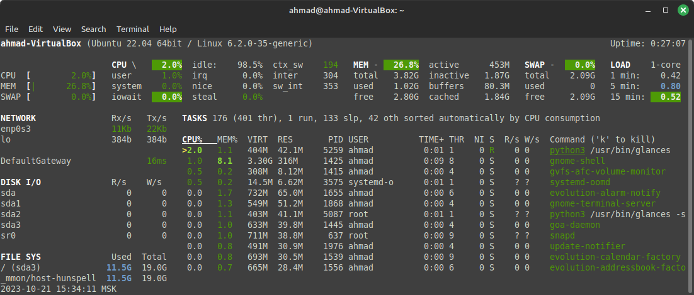

# 1. Processor, RAM, and Network Information:


## Processor Information

 - Using the command `lscpu` 
    - **Input:**
    ``` bash
        lscpu 
    ```
    
    - **Output** :

        ```bash
        Architecture:            x86_64
        CPU op-mode(s):        32-bit, 64-bit
        Address sizes:         39 bits physical, 48 bits virtual
        Byte Order:            Little Endian
        CPU(s):                  1
        On-line CPU(s) list:   0
        Vendor ID:               GenuineIntel
        Model name:            12th Gen Intel(R) Core(TM) i5-12500H
            CPU family:          6
            Model:               154
            Thread(s) per core:  1
            Core(s) per socket:  1
            Socket(s):           1
            Stepping:            3
            BogoMIPS:            6220.80
            Flags:               fpu vme de pse tsc msr pae mce cx8 apic sep mtrr pge mca cmov pat pse36 clflush mmx
                                fxsr sse sse2 ht syscall nx rdtscp lm constant_tsc rep_good nopl xtopology nonstop
                                _tsc cpuid tsc_known_freq pni pclmulqdq monitor ssse3 cx16 sse4_1 sse4_2 x2apic mov
                                be popcnt aes xsave avx rdrand hypervisor lahf_lm abm 3dnowprefetch pti fsgsbase av
                                x2 invpcid rdseed clflushopt md_clear flush_l1d arch_capabilities
        Virtualization features: 
        Hypervisor vendor:     KVM
        Virtualization type:   full
        Caches (sum of all):     
        L1d:                   32 KiB (1 instance)
        L1i:                   64 KiB (1 instance)
        L2:                    2 MiB (1 instance)
        L3:                    18 MiB (1 instance)
        NUMA:                    
        NUMA node(s):          1
        NUMA node0 CPU(s):     0
        Vulnerabilities:         
        Gather data sampling:  Not affected
        Itlb multihit:         KVM: Mitigation: VMX unsupported
        L1tf:                  Mitigation; PTE Inversion
        Mds:                   Mitigation; Clear CPU buffers; SMT Host state unknown
        Meltdown:              Mitigation; PTI
        Mmio stale data:       Not affected
        Retbleed:              Not affected
        Spec rstack overflow:  Not affected
        Spec store bypass:     Vulnerable
        Spectre v1:            Mitigation; usercopy/swapgs barriers and __user pointer sanitization
        Spectre v2:            Mitigation; Retpolines, STIBP disabled, RSB filling, PBRSB-eIBRS Not affected
        Srbds:                 Not affected
        Tsx async abort:       Not affected

        ```


##  RAM Information


- Using the command

    - **Input:**
        ``` bash
            free -m
        ``` 
    - **Output**:
        ```bash
                    total        used        free      shared  buff/cache   available
        Mem:            3907         730        2195          36         981        2918
        Swap:           2139           0        2139

        ```

## Network Information


- First install the following tool `net-tools`
    - **Input:**
    ``` bash
        sudo apt install net-tools
    ```
- Using the command  `ifconfig` 
    
    - **Input:**
    ``` bash
        ifconfig
    ```
    
    - **Output**:

        ```bash
            enp0s3: flags=4163<UP,BROADCAST,RUNNING,MULTICAST>  mtu 1500
                    inet 10.0.2.15  netmask 255.255.255.0  broadcast 10.0.2.255
                    inet6 fe80::b307:dfcc:e93:eef2  prefixlen 64  scopeid 0x20<link>
                    ether 08:00:27:d7:bb:33  txqueuelen 1000  (Ethernet)
                    RX packets 1072  bytes 1053557 (1.0 MB)
                    RX errors 0  dropped 0  overruns 0  frame 0
                    TX packets 488  bytes 54081 (54.0 KB)
                    TX errors 0  dropped 0 overruns 0  carrier 0  collisions 0

            lo: flags=73<UP,LOOPBACK,RUNNING>  mtu 65536
                    inet 127.0.0.1  netmask 255.0.0.0
                    inet6 ::1  prefixlen 128  scopeid 0x10<host>
                    loop  txqueuelen 1000  (Local Loopback)
                    RX packets 137  bytes 12003 (12.0 KB)
                    RX errors 0  dropped 0  overruns 0  frame 0
                    TX packets 137  bytes 12003 (12.0 KB)
                    TX errors 0  dropped 0 overruns 0  carrier 0  collisions 0


        ```


# 2: Operating System Specifications

- install the tool for displaying sys info :
    - **Input:**
    ``` bash
        sudo apt install inxi
    ```

- Then using the following command:
    - **Input:**
    ``` bash
        inxi -F
    ```
    - **Output**:
        ```bash
                    System:
            Host: ahmad-VirtualBox Kernel: 6.2.0-35-generic x86_64 bits: 64 Console: pty pts/1
                Distro: Ubuntu 22.04.3 LTS (Jammy Jellyfish)
            Machine:
            Type: Virtualbox System: innotek GmbH product: VirtualBox v: 1.2 serial: <superuser required>
            Mobo: Oracle model: VirtualBox v: 1.2 serial: <superuser required> BIOS: innotek GmbH
                v: VirtualBox date: 12/01/2006
            Battery:
            ID-1: BAT0 charge: 17.0 Wh (34.0%) condition: 50.0/50.0 Wh (100.0%) volts: 10.0 min: 10.0
            CPU:
            Info: single core model: 12th Gen Intel Core i5-12500H bits: 64 cache: L2: 2 MiB
            Speed (MHz): 3110 min/max: N/A core: 1: 3110
            Graphics:
            Device-1: VMware SVGA II Adapter driver: vmwgfx v: 2.20.0.0
            Display: server: X.org v: 1.21.1.4 with: Xwayland v: 22.1.1 driver: gpu: vmwgfx
                note:  X driver n/a tty: 108x24
            Message: GL data unavailable in console. Try -G --display
            Audio:
            Device-1: Intel 82801AA AC97 Audio driver: snd_intel8x0
            Sound Server-1: ALSA v: k6.2.0-35-generic running: yes
            Sound Server-2: PulseAudio v: 15.99.1 running: yes
            Sound Server-3: PipeWire v: 0.3.48 running: yes
            Network:
            Device-1: Intel 82540EM Gigabit Ethernet driver: e1000
            IF: enp0s3 state: up speed: 1000 Mbps duplex: full mac: 08:00:27:d7:bb:33
            Device-2: Intel 82371AB/EB/MB PIIX4 ACPI type: network bridge driver: piix4_smbus
            Drives:
            Local Storage: total: 20 GiB used: 10.75 GiB (53.8%)
            ID-1: /dev/sda vendor: VirtualBox model: VBOX HARDDISK size: 20 GiB
            Partition:
            ID-1: / size: 19.02 GiB used: 10.75 GiB (56.5%) fs: ext4 dev: /dev/sda3
            ID-2: /boot/efi size: 512 MiB used: 6.1 MiB (1.2%) fs: vfat dev: /dev/sda2
            Swap:
            ID-1: swap-1 type: file size: 2.09 GiB used: 0 KiB (0.0%) file: /swapfile
            Sensors:
            Message: No sensor data found. Is lm-sensors configured?
            Info:
            Processes: 174 Uptime: 10m Memory: 3.82 GiB used: 965.4 MiB (24.7%) Init: systemd runlevel: 5
            Shell: Bash inxi: 3.3.13

        ```


# Analyize the system information using **glances**
- Install glances
- **Input:**
    ``` bash
         sudo apt install glances
    ```
- **Input:**
    ``` bash
         glances
    ```
    - **Output** :

        


