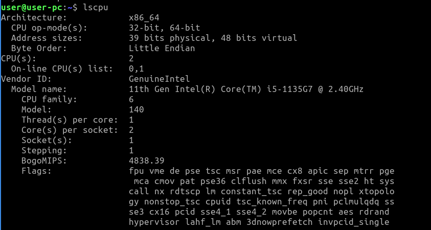
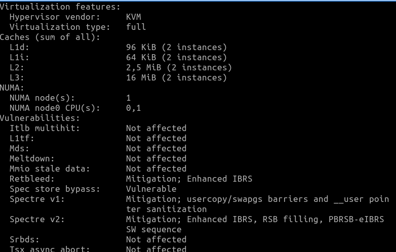
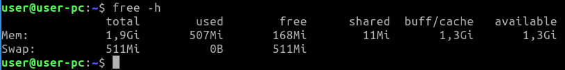
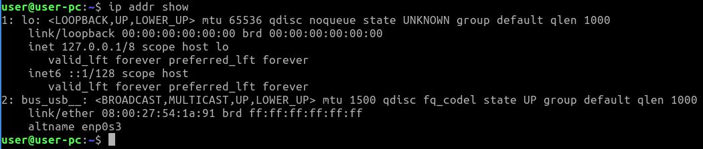

# Task 2: System Information Tools

> Important: Those information which is not fitting in one screenshot are copy-pasted from teminal to the Markdown file in the text format.

## 1. Processor

### To check the processor model and basic information:
> lscpu

## 2. RAM (Memory) Information:

### To check the total available memory and usage statistics:
> free -h

## 3. Network Information:

### To check network interfaces and their status:
> ip addr show

