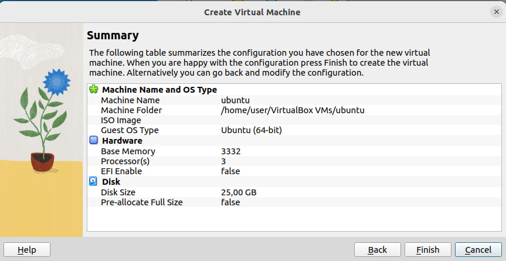
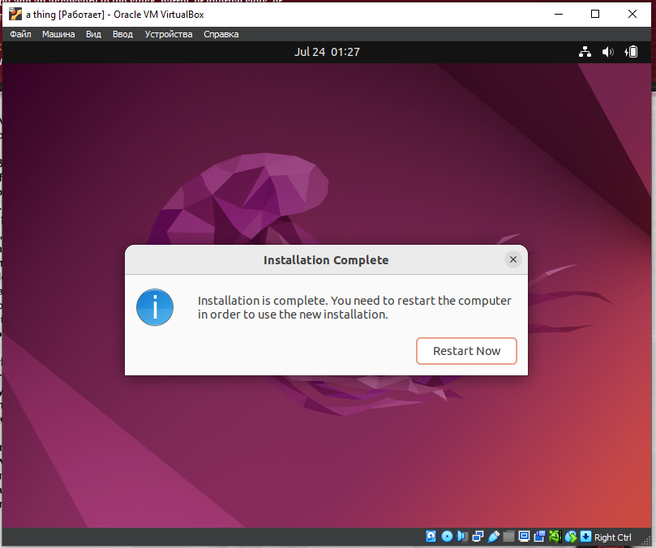

# Virtual Machine Report

## Installing

I have use [link](https://www.virtualbox.org/wiki/Linux_Downloads) to download latest version of Virtual Box.
Then I installed it and so now I have Virtual Box 9.0

## Creation

Now I press the **New** button and create a new VM. After that I adjust some settings like drive, number of CPU cores and memory. You can see a summary on the picture below:

## Result

Finally I start up my virtual machine and so it is working now

