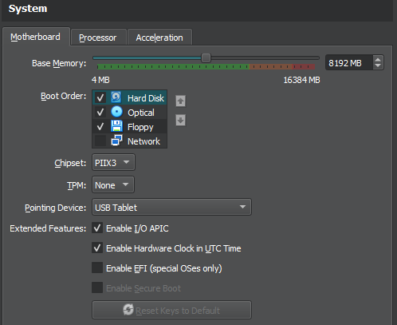
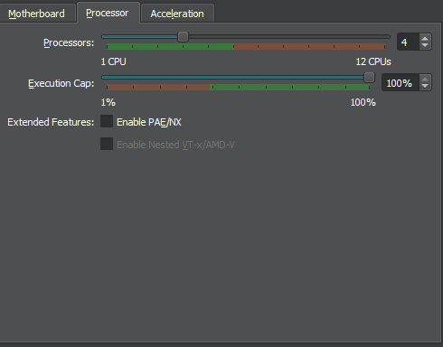
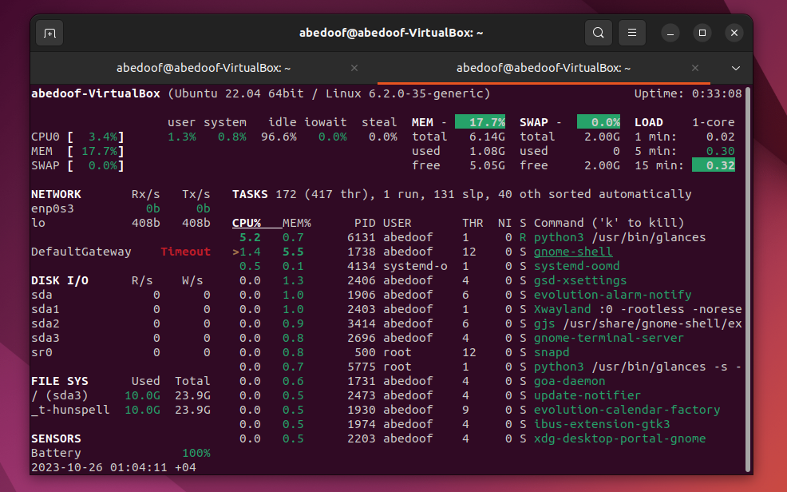
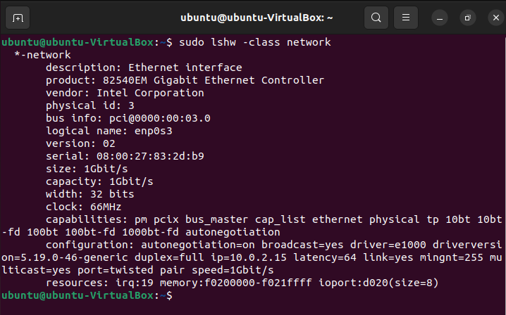
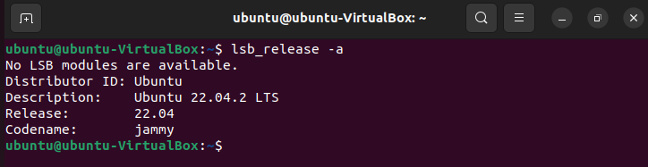
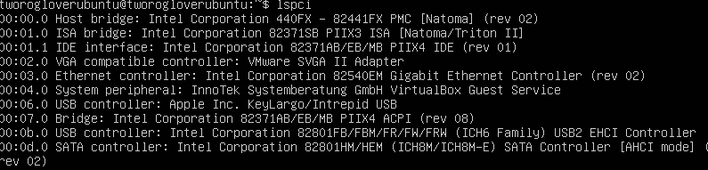
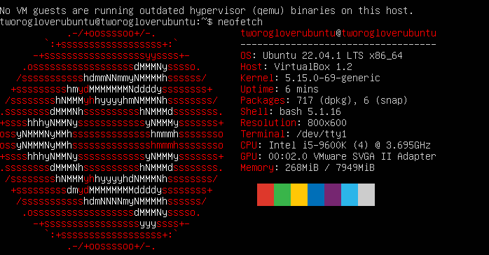
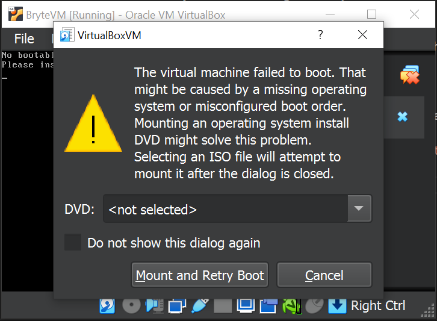
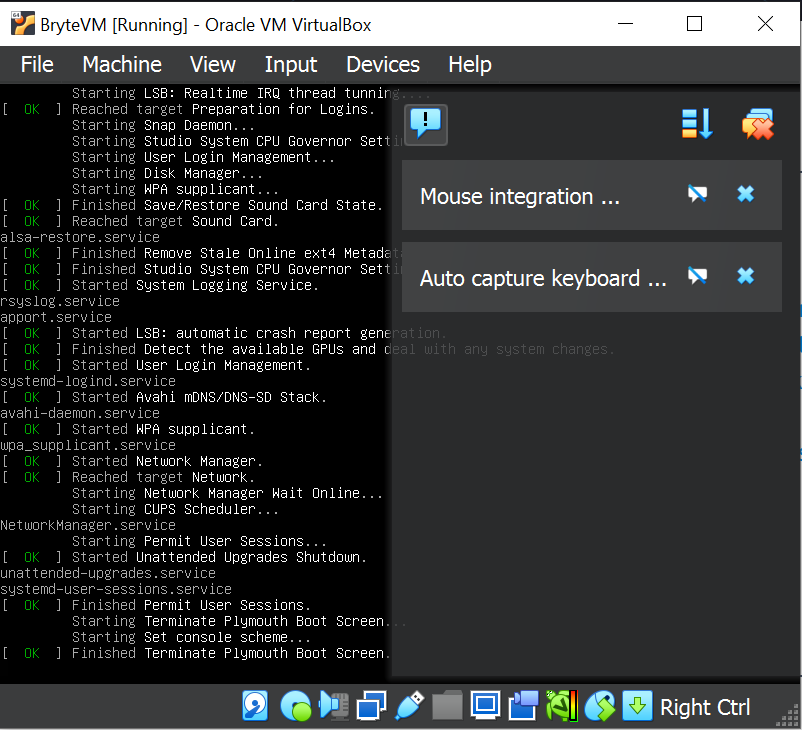
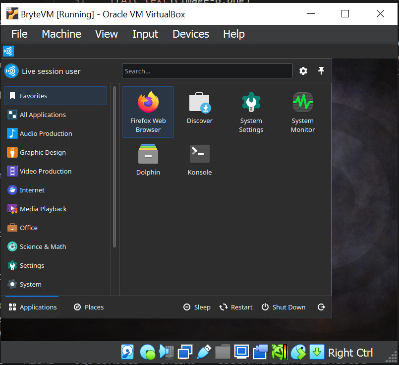

# Virtualization Lab

## Task 1: VM Deployment

### To install VirtualBox, follow these steps:

- Go to the official website of [VirtualBox](https://www.virtualbox.org/wiki/Downloads) and download the appropriate version for your operating system.
- Once the download is complete, double-click on the downloaded file to start the installation process.
- Follow the instructions displayed to install VirtualBox on your system.

### To deploy a Virtual Machine using VirtualBox, follow these steps:

- Open VirtualBox and click on the "New" button to create a new virtual machine.

- In the "Name and operating system" section, give a name to your VM and choose "Linux" as the type and "Ubuntu" as the version. And click next.

- In the "Memory size" section, allocate the desired amount of memory to your VM. And click next.

- In the "Hard disk" section, choose "Create a virtual hard disk now", give the size and click on next.

- You will see the summary of the configuration, then click finish to proceed.

- Start your VM by selecting it from the list of virtual machines and clicking on the "Start" button.

- I got the below error and I have to download the iso file from https://ubuntustudio.org/download and mount it.

