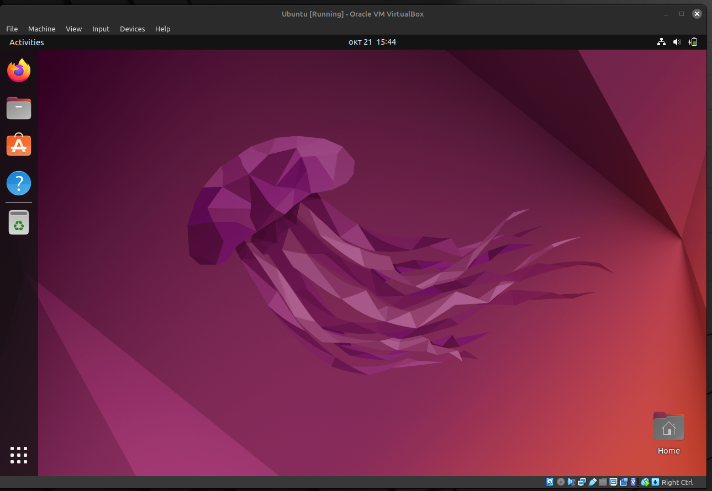

## VM Deployment
I used my Linux mint system to do this task:
1. First install VirtualBox on the mint system as using the following command :
    **input**
    ``` bash
        sudo apt install virtualbox
    ```
    Check the verision of the VirtualBox:
    VirtualBox version : 
    ``` bash
        VirtualBox Graphical User Interface Version 6.1.38_Ubuntu r153438
    ```
2. Now to deployed new virtual machine with ubuntu OS using the following configuration:
    - Chose ubuntu (64-bit) for OS.
    - Chose 4GB RAM and  1 CPUs.
    - Chose disk as dynamically allocated with 20GB storage capacity.
    - Chose the max amount for video memory 16MB.
    - Chose the ubuntu 22.04 iso image as source for installing the sysytem to the virtual machine.
    
    - The following image for the virtual machine running ubuntu: 