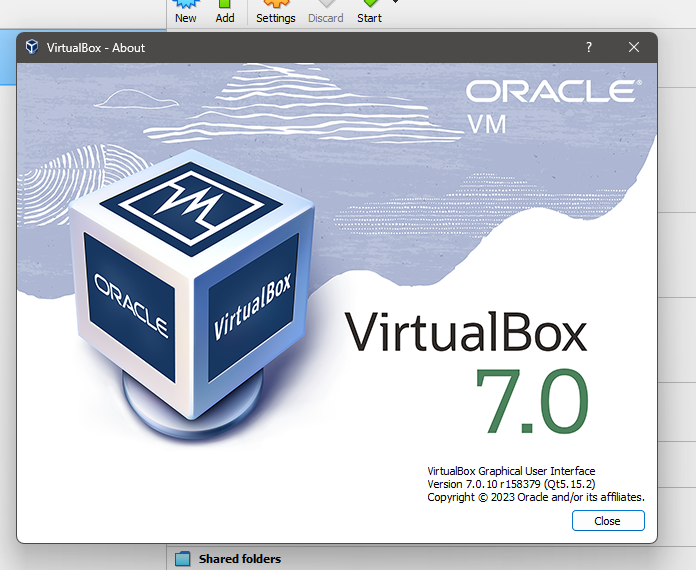
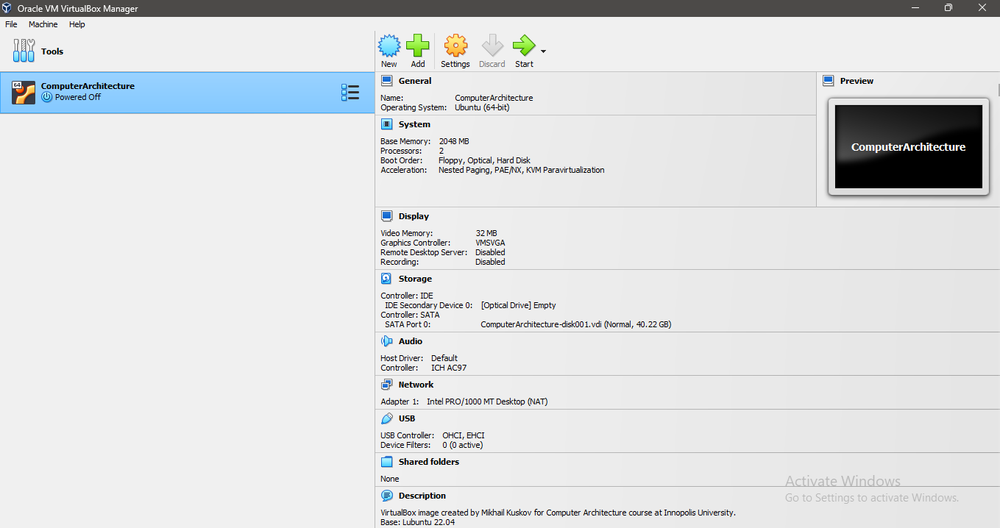
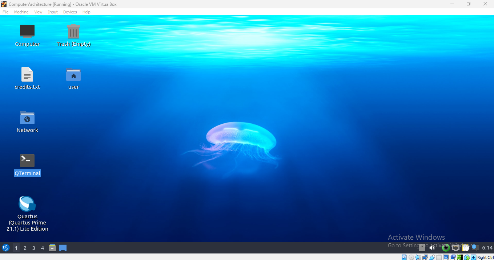

# Task 1: VM Deployment

## 1. Install VirtualBox

To download VirtualBox refer to the **official website**:
> https://www.virtualbox.org/

The version of the installed VirtualBox on my system:
> VirtualBox 7.0

### Steps
1. Run the VirtualBox.
2. Click on the **New** button.
3. In the opened window set the **Name**, **Folder**.
Live the **ISO Image** empty for now.
For **Type** select **Linux** and select the **Version** which in my case is **Oracle Linux (64-bit)**. Select Next.
4. Choose the arbitary amount of **Base Memory** and **Processors**. Select Next.
5. Choose the amount of the arbitary **Virtual Hard Disk**. Select Next.
6. Review the **Summary** of the created virtual machine and the select Finish.
7. On the left menu right click on the created virtual machine and select **Settings** option.
8. Got to **Storage** tab and add your ISO Image to the **Controller: IDE**.
9. Run the virtual machine and install the Linux.
10. After finishing the installing process, go to virtual machine settings **Storage** tab and eject the ISO Image.
11. Run your virtual machine and enjoy:))

