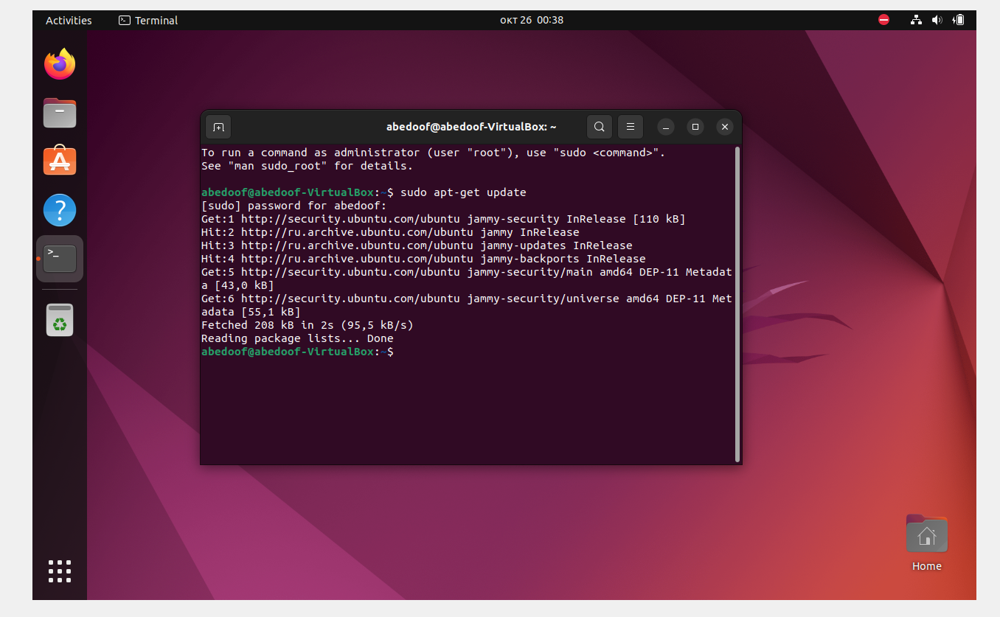

# Lab 07:
## Task 1:
### Installing VM client:

For this task we will install a vistal machine application on *Windows* OS client, virtual box.

- First we download the application from the official website : **https://www.virtualbox.org/wiki/Downloads**

- The downloaded version is : **7.0.12**
- upon the deployment of the VM, we selected the  virtual OS to be *Ubuntu 22*
- while installing the virtual OS, we configured the desired RAM and CPU to utilize. The configurations are listed in the attached image below.
    *****************

************
### Installing Virtual OS:

- For installing the virutal OS,  we **checked** ```Skip Unattended Installation``` for manual installation.

- After following the normal procedures, the virtual OS worked successfully. 

Below is an attached image of the virtual OS:
******************


