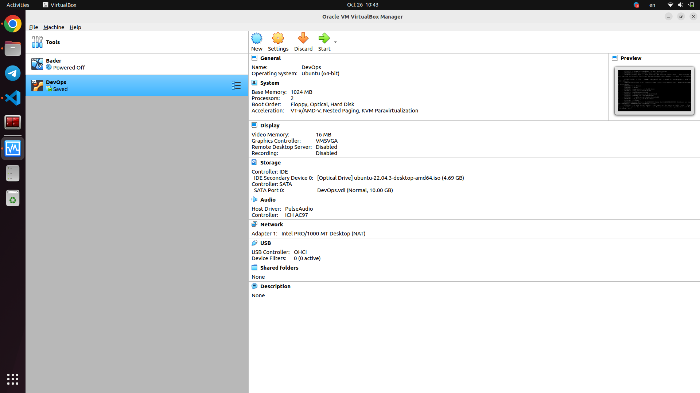
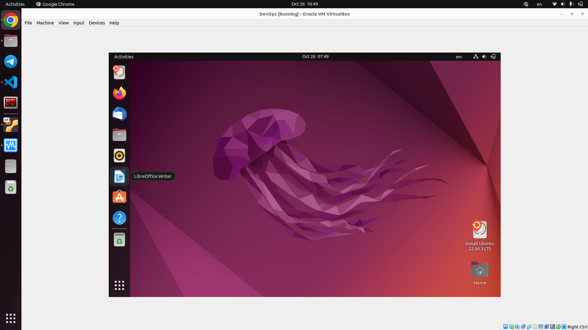

# VM Deployment
1. isntall VirtualBox: 
```bash
sudo apt-get install virtualbox
```

2. My current version is: 
```bash
VirtualBox Graphical User Interface Version 6.1.38_Ubuntu r153438
```

3. Deployed vm using ubuntu with the follwoing configuration: 
- OS: Ubuntu 64-bit 
- Processors: 2
- Storage: 10 G
- Screenshots from my VM:   