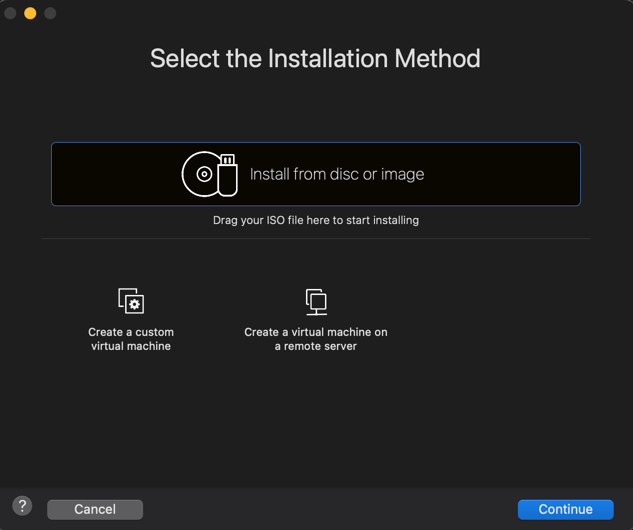
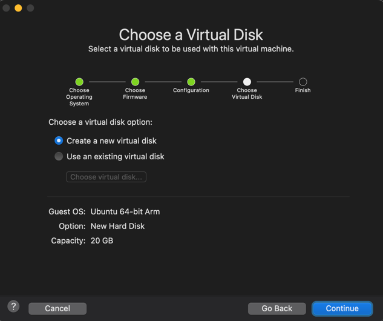
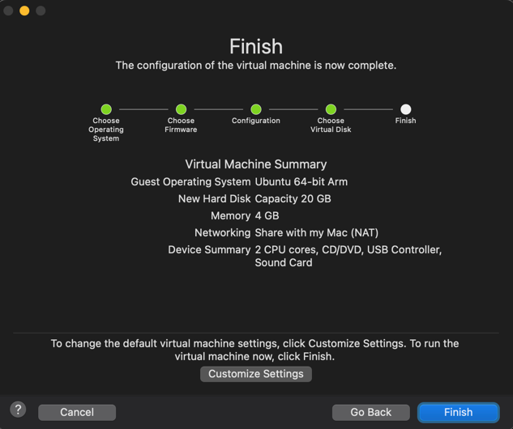
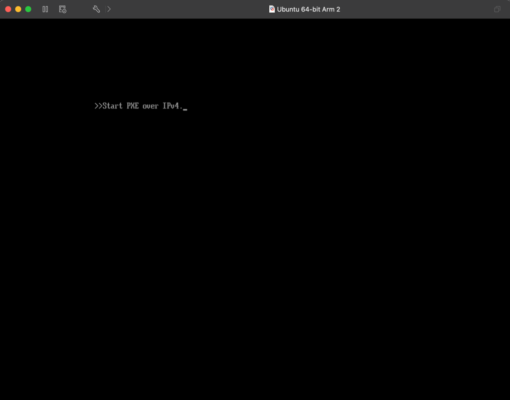

## VMReport

### Download and install VirtualBox from the official website based on your operating system.

### Create a new Virtual Machine (VM) using VirtualBox and choose the Ubuntu operating system:

### Customize the VM settings, such as the allocated memory, number of CPU cores, and network configuration.

### Take a screenshot of the VM running and include it in your report.

### Note: 
As I'm using macOS there is not any available image of VirtualBox. That is why I used VM Ware.
