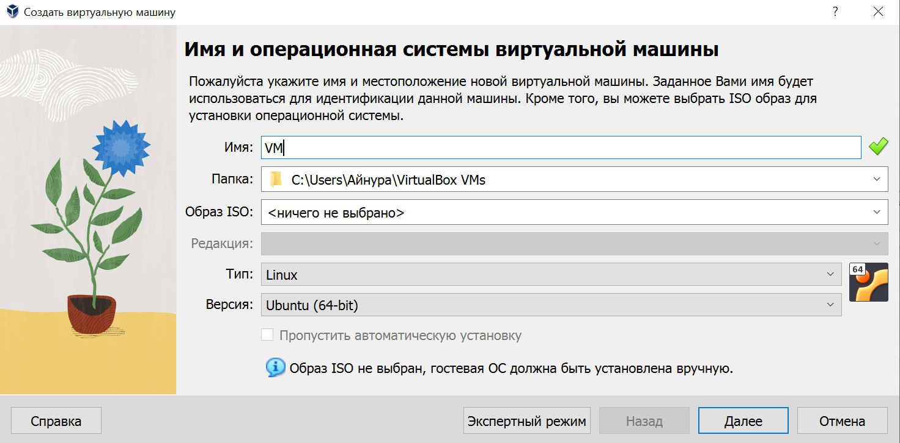
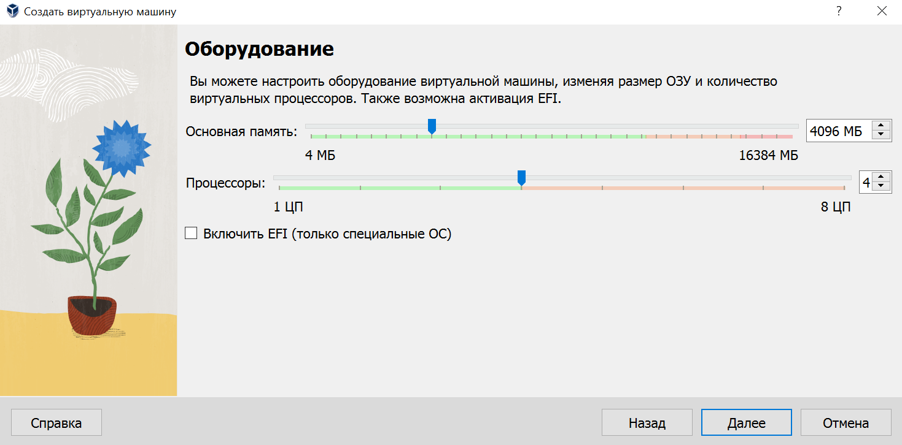
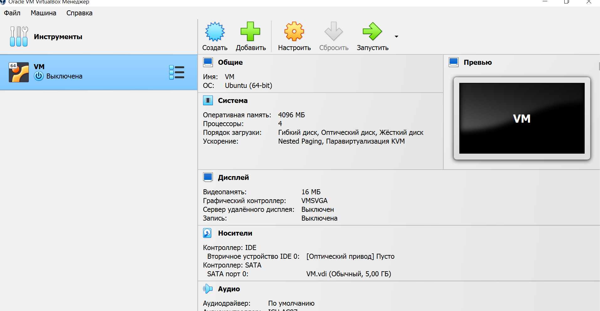
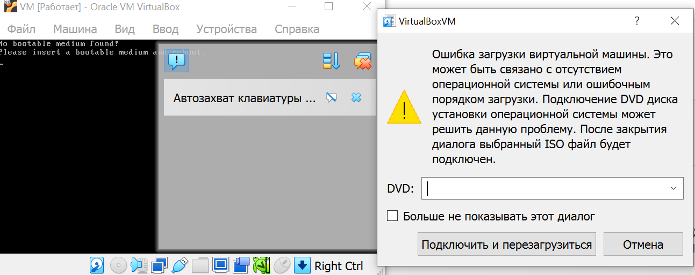
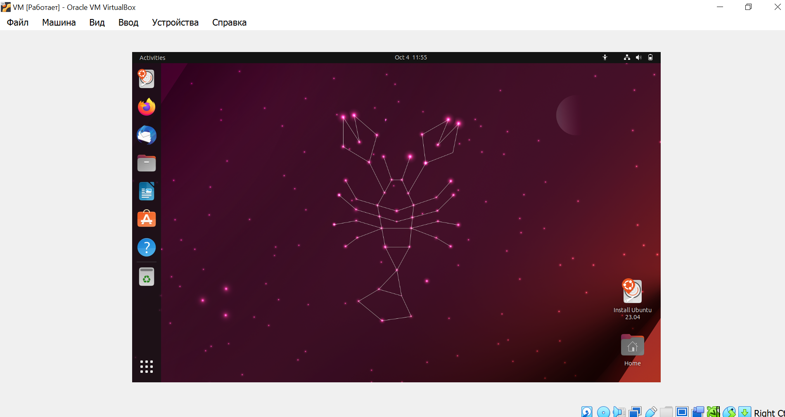

# Task 1: VM Deployment

1. *Installation*

    I installed VirtualBox of version 7.0.10.

2. *Deploying a Virtual Machine*

    1. Creating new Virtual Machine with Ubuntu operating system.
 
        

    2. Setting the allocated memory(4096 MB) and number of CPU cores (4).

        

    3. Creating the virtual hard drive (with 5 GB memory).

        

    4. The deployed VM.

        

3. *Running VM*

    1. I encountered the error after running the VM. The problem was that I should've chosen the ISO file for operating system (Ubuntu) manually.  
        
        
    
    2. After adding the ISO file VM ran successfully:

        
        