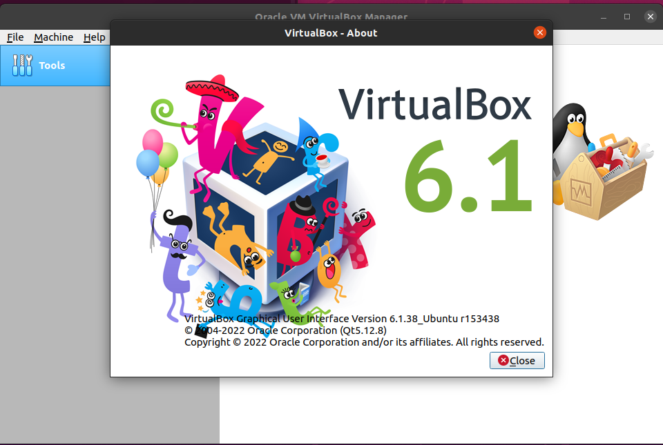
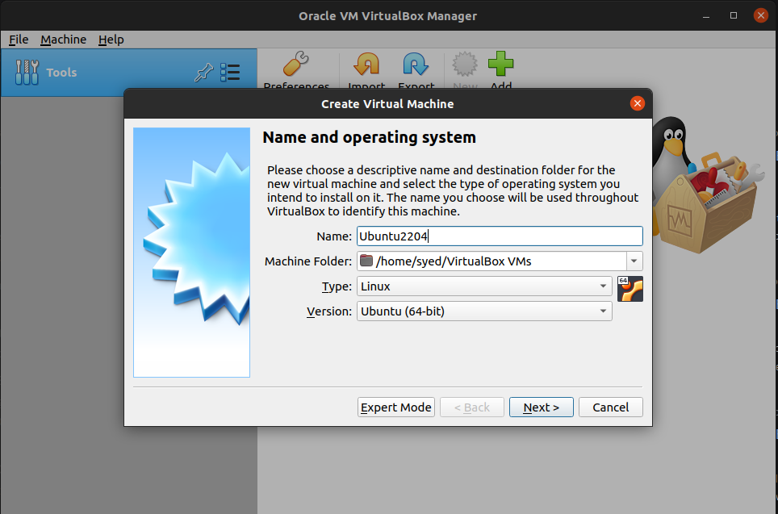
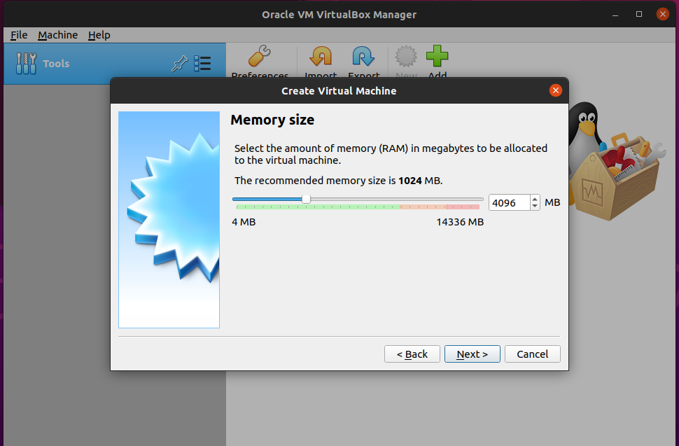
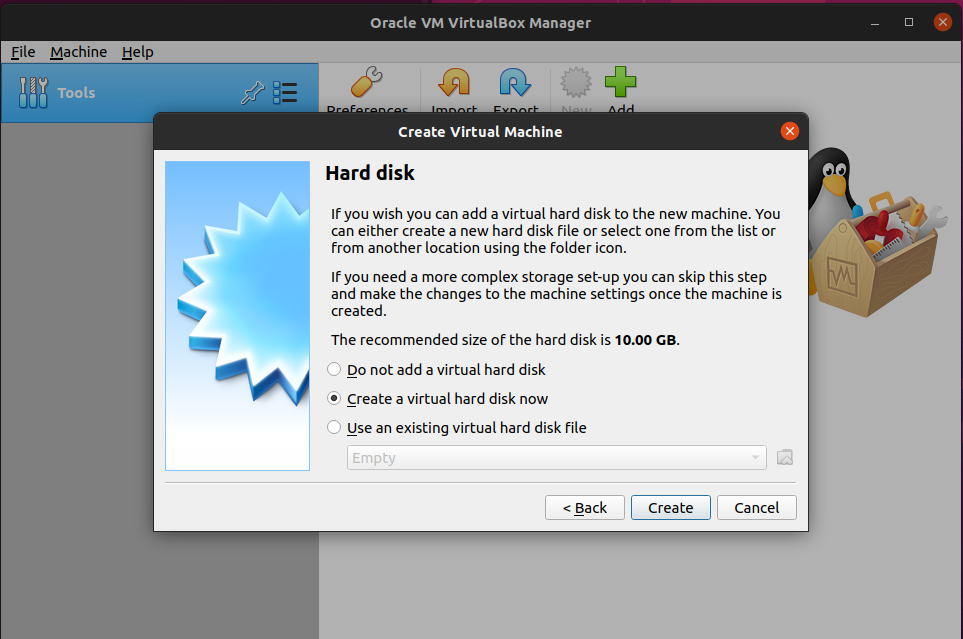
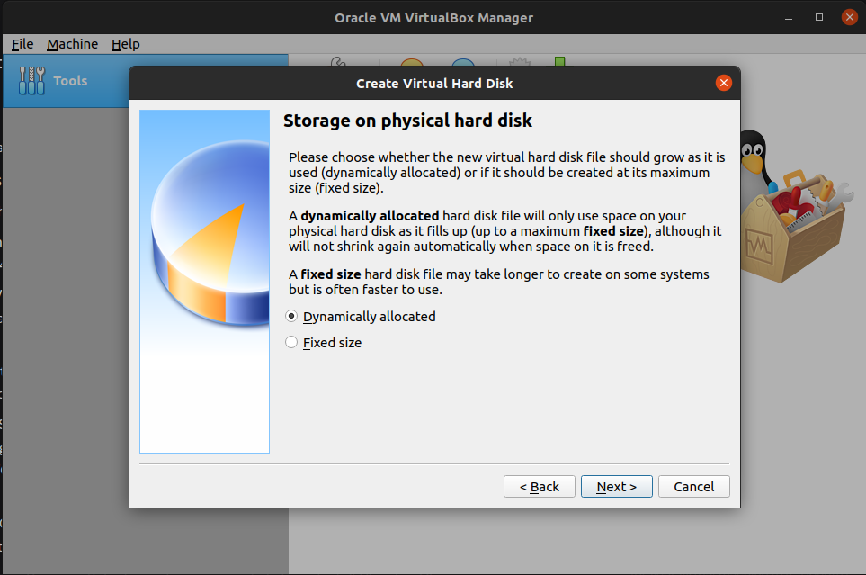
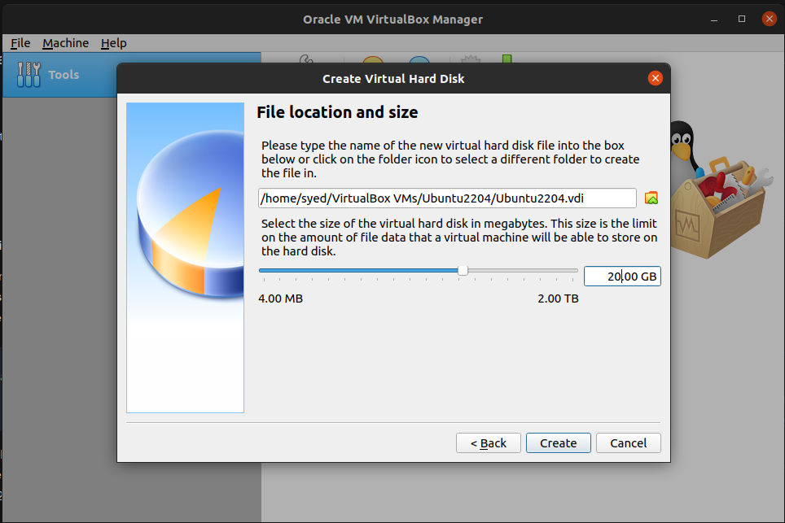
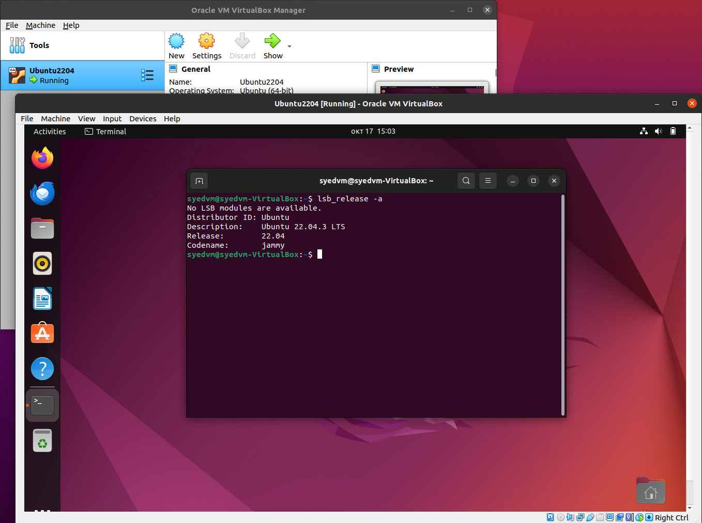

## Task 1: VM Deployment

## 1. **Install the Virtual Box** 
use the following commands (On Linux based os)
```shell
    sudo apt update
    sudo apt-get install virtualbox
```

## 2. ** Fixes**
If you face any issues relating to the linux-headers/virtualbox-dkms you need to follow the below steps

```shell
    sudo apt update
    sudo apt install --reinstall linux-headers-$(uname -r) virtualbox-dkms dkms
    sudo reboot
```
> and then select Machine Owner Key (MOK) from the boot menu and reboot

## 3. **Check the VirtualBox version:**
 we can check it in the virtual box in the help tab from menu bar
```shell
    virtualbox
```
> VirtualBox  6.1.38_Ubuntu Version



## 4. **Create a new Virtual machine:** 

click on "New" to create a new virtual machine. Enter the name of the vm (in my case Ubuntu2204), select the type as "Linux" and select "Ubuntu (64 bit) as the version"




## **5. Create a virtual hard disk:** 
Choose "create a virtual hard disk now" and click "Create". Select "VDI (Virtual Box Disk Image)" and click "Next". Then choose "Dynamically allocated memory"  and click "Next". Specify the size of the hard disk (20 Gb in my case) and click "Create".






## **6. Download and Attach the ISO file in side the VirtualBox**
- Download the iso file of the Ubuntu os 22.04 from [here](https://ubuntu.com/download/desktop)

- Attach the Ubuntu 22.04 ISO file to the virtual machine: select the newly created virtual machine and click on settings. Go to the "Storage" tab , and under "Controller IDE", click on "Empty", then click on the CD icon next to the "Optical drive" and selct "Choose a file from disk". Browse to your iso file and select it.


## 7. Now start the VM
by clicking "start". It will boot up using the attached iso file and start the Ubuntu 22.04 installer.

## 9. Now go through the first time settings to setup the ubuntu 22.04
Finally Run Ubuntu 22.04 in VirtualBox
