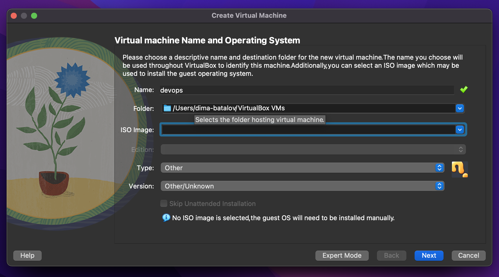
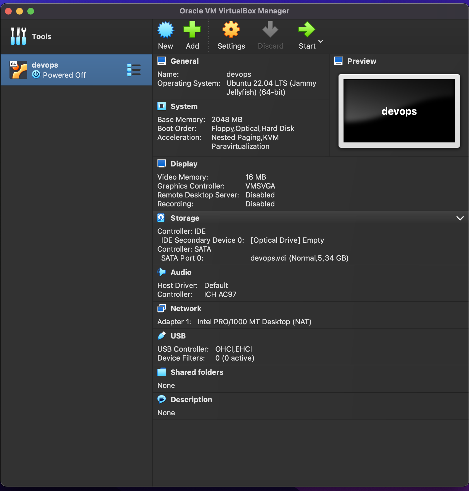
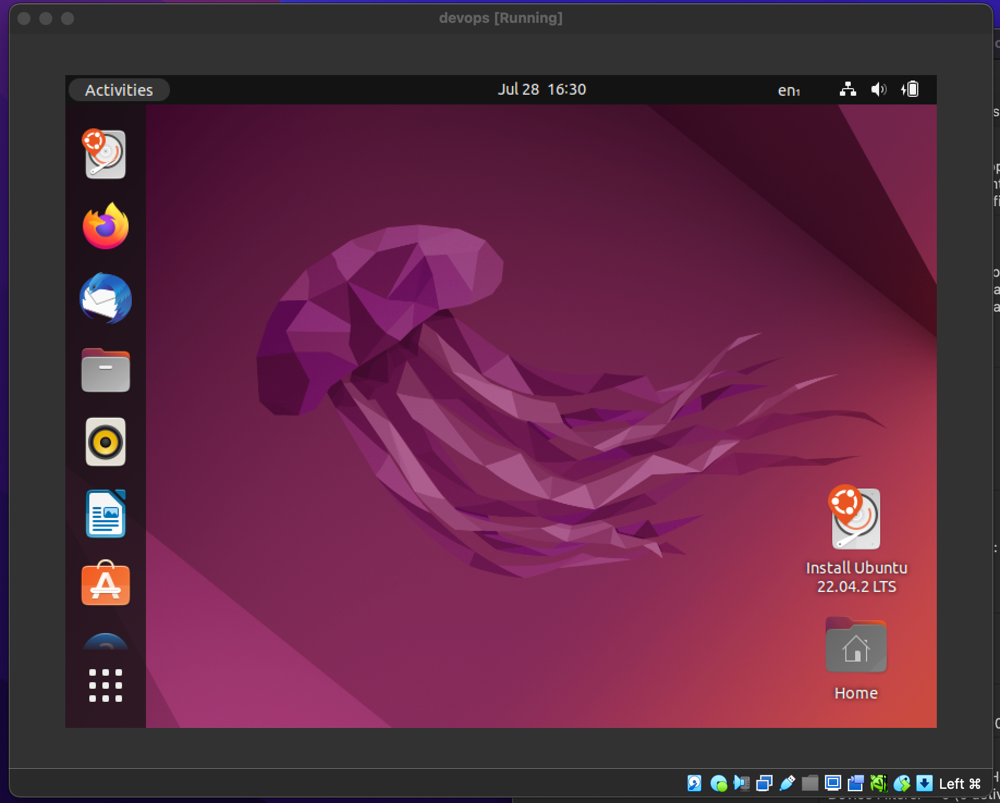

# Virtual Machine

## Downloading VirtualBox

```bash
brew install --cask virtualbox
virtualbox --help
# Oracle VM VirtualBox VM Selector v7.0.10
# Copyright (C) 2005-2023 Oracle and/or its affiliates
# 
# No special options.
# 
# If you are looking for --startvm and related options, you need to use VirtualBoxVM.
```

Then download `ubuntu` image

Then create a VM in VirtualBox interface and set downloaded ubuntu image





