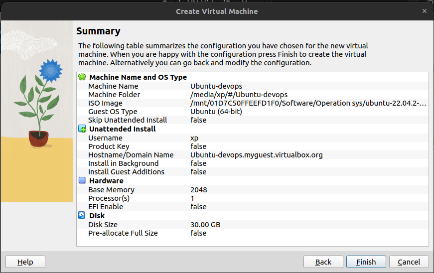
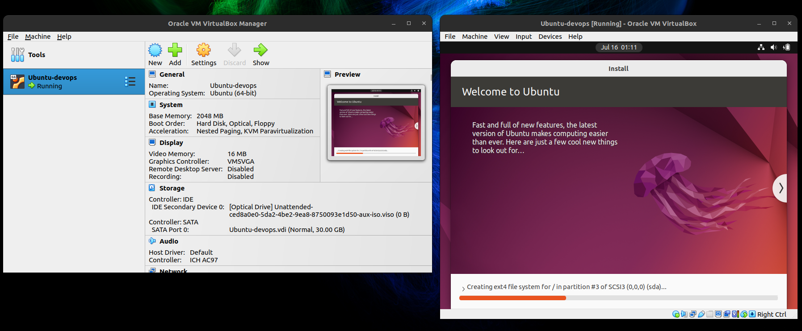

# Lab7: Virtualization Lab 

- Zeyad Alagamy
- BS-CS-01
- z.alagamy@innopolis.university

## 1.1 Install VirtualBox:

- My Linux distro is "Ubuntu 22.04.2 LTS". Thus, we can download the `virtual box` from this [link](https://www.virtualbox.org/wiki/Linux_Downloads). 

- Then I downloaded this [v7.0.8](https://download.virtualbox.org/virtualbox/7.0.8/virtualbox-7.0_7.0.8-156879~Ubuntu~jammy_amd64.deb)

- I clicked on the downloaded file and open it with `software install`. And, clicked install.

- To get the virtual box virsion. I used:

``` bash
$ vboxmanage -v
7.0.8r156879
```
- The virtual box version: `7.0.8r156879`

## 1.2 Deploy a Virtual Machine:

- Downloaded Ubuntu ISO 22.04 from the official website, [link](https://ubuntu.com/download/desktop/thank-you?version=22.04.2&architecture=amd64). 

- Opend the virtual box GUI.

- Clicked on `create new`.

- Imported the iso image.

- added username and passord for the image.

- Customized the virtual settings as shown below:



- Then clicked `Finsih`.

- Opened the image and complete the installation process of Ubuntu.


