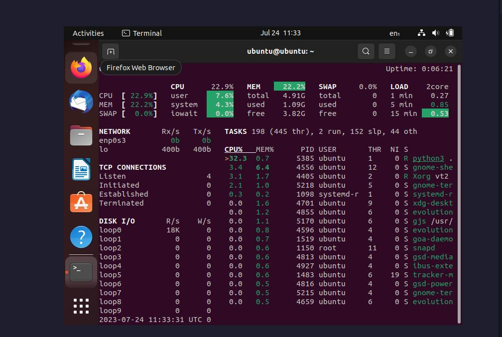
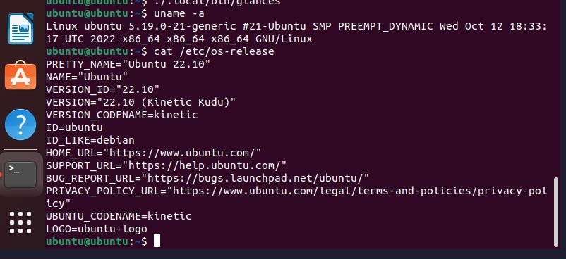

# System Info Tools (Amirlan Sharipov)

## glances
glances tool works perfectly to monitor everything at the same time.
To install it, run:
```
pip install glances
```


## uname -a and cat /etc/os-release
uname -a prints a lot of info about the OS kernel
/etc/os-release file has other information about the OS

