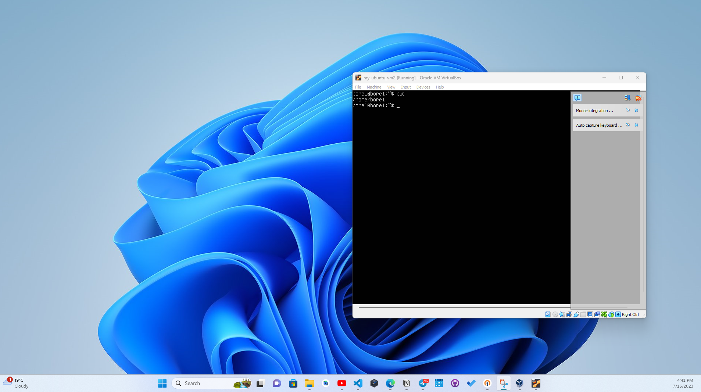

# Virtualization Lab

```
DevOps Toolchain Category: Virtualizatino tools
```

## VM Deployment :

### Environment Charaterictis :

- My Computer type: PC
- My Operating system: Microosft Windows 11
- Virtualization tool used : VirtualBox
- VirtualBox version number : 7.0.8-156879-win

### VM Deployment steps :

1. Download and install VirtualBox executable.
2. I downloaded the ISO image of the OS to virtualize, for this lab Ubuntu server_22.04.2
3. To create a virtual machine, I launched virtual box and clicked on the "New" button in menu.
4. Then I entered the name of the VM and chose the Ubuntu ISO image to be install on the VM. (I checked skip unattended installation box)
5. I allocated base memory and processors.
6. I created a virtual hard disk and finish the the setup
7. After that, the VM was listed and ready to be ran.

### Running VM, with Unbuntu server


