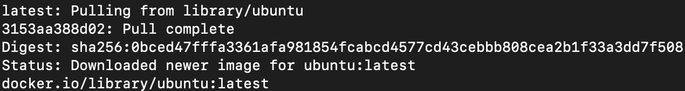

# First Task

## Task 1: Container Management

### 1. List Containers:
> docker ps

This command will display a list of all the running Docker containers along with their details such as container ID, name, status, ports, and more. If you want to see all containers (including stopped ones), you can add the '-a' or '--all' flag:

> docker ps --all

**Result:**

``` sh
CONTAINER ID   IMAGE                                      COMMAND                  CREATED       STATUS                     PORTS                                                                  NAMES
d28263c2f008   docker-agona-course                        "java -jar app.jar"      13 days ago   Up 4 seconds               0.0.0.0:8091->8080/tcp                                                 docker-agona-course-1
f1bbe60f9d98   minio/minio:RELEASE.2022-08-05T23-27-09Z   "/usr/bin/docker-ent…"   13 days ago   Exited (255) 13 days ago   0.0.0.0:9000-9001->9000-9001/tcp                                       minio
93124c97d4fa   postgres:12-alpine                         "docker-entrypoint.s…"   13 days ago   Up 4 seconds               0.0.0.0:6433->5432/tcp                                                 course-db
927152d8be0a   postgres:12-alpine                         "docker-entrypoint.s…"   13 days ago   Exited (1) 13 days ago                                                                            strange_pike
8f3172d189b6   minio/minio:RELEASE.2022-08-05T23-27-09Z   "/usr/bin/docker-ent…"   13 days ago   Exited (0) 13 days ago                                                                            priceless_leakey
652d0b4ef7e8   consul:1.8.3                               "docker-entrypoint.s…"   13 days ago   Exited (255) 13 days ago   8300-8302/tcp, 8500/tcp, 8301-8302/udp, 8600/tcp, 8600/udp             gallant_shtern
a9f18b4714d9   rabbitmq:3.9.5-management                  "docker-entrypoint.s…"   13 days ago   Exited (255) 13 days ago   4369/tcp, 5671-5672/tcp, 15671-15672/tcp, 15691-15692/tcp, 25672/tcp   inspiring_franklin
7a44bfec729b   rabbitmq:3.9.5-management                  "docker-entrypoint.s…"   13 days ago   Exited (255) 13 days ago   4369/tcp, 5671-5672/tcp, 15671-15672/tcp, 15691-15692/tcp, 25672/tcp   youthful_wilbur
58d59c2e1c49   docker-agona-account                       "java -jar app.jar"      2 weeks ago   Up 4 seconds               0.0.0.0:8090->8080/tcp                                                 docker-agona-account-1
6ba99acf0b46   postgres:12-alpine                         "docker-entrypoint.s…"   2 weeks ago   Up 4 seconds               0.0.0.0:6432->5432/tcp                                                 account-db
4d8278842eb2   rabbitmq:3.9.5-management                  "docker-entrypoint.s…"   2 weeks ago   Up 5 seconds                                                                                      docker-rabbitmq-1
f65254264b97   021283c8eb95                               "/docker-entrypoint.…"   2 weeks ago   Exited (255) 2 weeks ago   0.0.0.0:8080->80/tcp                                                   ExampleNginxContainer
8caf8e73296e   budtmo/docker-android:emulator_11.0        "/home/androidusr/do…"   4 weeks ago   Created                    4723/tcp, 5554-5555/tcp, 5900/tcp, 9000/tcp, 0.0.0.0:6080->6080/tcp    android-container
```


### 2. Pull Latest Ubuntu Image:

> docker pull ubuntu:latest





### 3. Run Container:

> docker run ubuntu:latest

### 4. Remove Image:

First collect the image ID by the following command: 

> docker ps

```sh
3326db087c22   ubuntu:latest                              "/bin/bash"              About a minute ago   Running About a minute ago                                                                          relaxed_heisenberg
```

Then remove by following command:

> docker rmi <your-image-id>

In my case:

> docker rmi 3326db087c22

If the image you want to remove is currently being used by one or more containers, you might encounter an error stating that the image is in use. In that case, you can force the removal of the image by adding the -f or --force option to the command:

> docker rmi -f 3326db087c22


