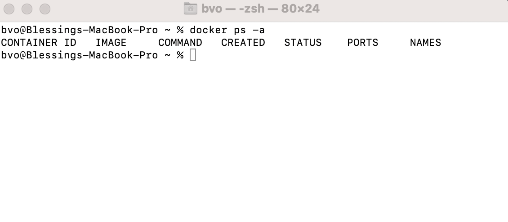
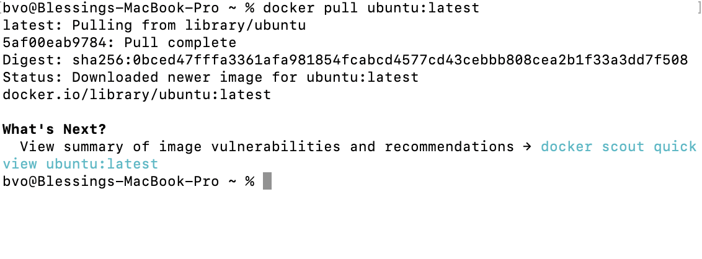
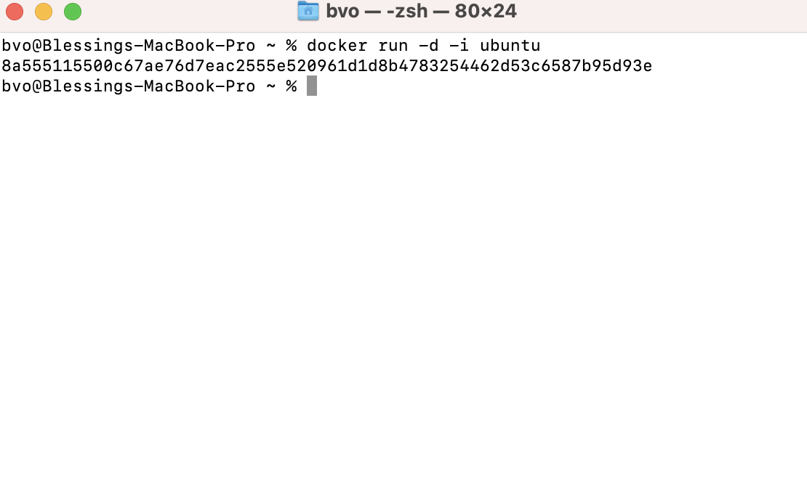
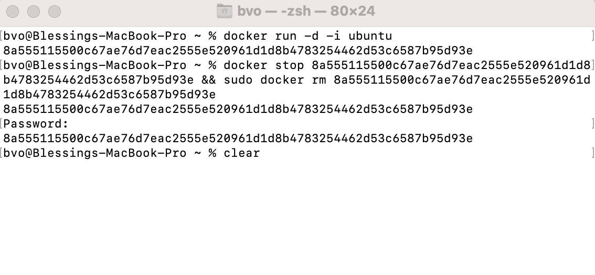

# Containers Lab - Docker

## Task 1: Container Management

### 1. List Containers:

- **Command**: `docker ps -a`
- **Output**: Nothing because I have not created any docker container yet.

  

### 2. Pull Latest Ubuntu Image:

- **Command**: `docker pull ubuntu:latest`
- **Output**:

### 3. Run Container:

- **Command**: `docker run -d -i ubuntu`
- **Output**:

### 4. Remove Image:

- **Command**: `docker stop 8a555115500c67ae76d7eac2555e520961d1d8b4783254462d53c6587b95d93e && sudo docker rm 8a555115500c67ae76d7eac2555e520961d1d8b4783254462d53c6587b95d93e`
- **Output**:

